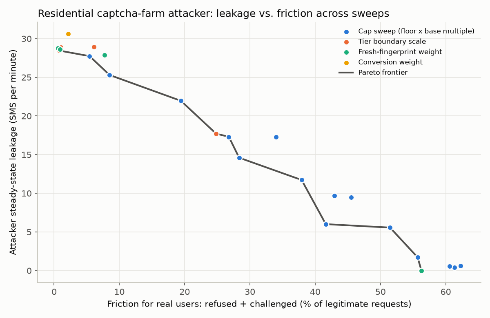

# OTP Guard: OTP flood protection

A layered SMS validation, risk-scoring and rate-limiting pipeline that stops OTP flood
abuse against a registration endpoint. This repository holds the problem statement, the
design with pseudocode, a full implementation with real vendor adapters, a test suite, and
recorded results.

[](https://github.com/nahmedpsu/OTP-DDOS/actions/workflows/ci.yml)

## What the evaluation shows, in four results

The evaluation is entirely simulated (see "Status and artifact availability"); every number
below resolves to a study, seed set and JSON path in `results/headline_numbers.md`, and the
simulator's own invariants (identical offered traffic across designs, identical legitimate
traffic across attack scenarios, cohort conservation, clock progression, drain) are asserted by
tests. Within it, the thesis the results support is narrower than a theorem: **in this design,
outcome-based reputation separated an attacker from users in the tested settings only when the
attacker dominated the key it was judged on.** Client-side keys (IP, fingerprint, session) can be
rotated for almost nothing and a CAPTCHA solve costs about 0.003 USD, so the attacker decides how
pure those keys are. What a pumper cannot rotate is the destination: it is paid only on the
number blocks its partner carrier terminates.

1. **Positive, with the residue stated.** Attacks that leave a signature in the request are
   contained in all 30 seeds with 77.5 to 79.1 % of simulated users completing registration,
   against 79.3 % with no attack: datacenter IP rotation and premium-rate pumping leak 0 of
   about 600 requests, a single client 2, a sequential-number walk 61 to 69 before its
   destination block reaches a verdict. The cost is not zero: 1.1 to 3.5 % of first-time users
   are refused and 1.6 % challenged, against 0.9 % refused with no attack. In the predeclared
   robustness study (held-out attack rates and pools, 12 jointly shifted operating points),
   the claim "leak at most 5 % and lose at most 2 points of completion against no attack at the
   same point and seed" held in 108 of 108 cells. A flat limit of five sends per destination
   block per day stops the walk and the premium pumper at 5 SMS each.
2. **Negative, and general.** A residential flooder that looks like a real user (farmed
   CAPTCHA scores, fresh or pre-aged fingerprints, valid numbers) leaves nothing but rationing.
   Against it v1 with static caps leaks 555 of about 590 and refuses 4.5 % of first-time users;
   v2's adaptive cap leaks 229 and refuses 54 % of first-time users, so 45.5 % of all simulated
   users complete instead of 79 %. That gain is rationing, and it depends on the controller's
   cadence and phase (section B2): every 2 minutes it is nearly the same (276 leaked), every 5
   minutes 386 or 533 depending on the tick phase, every 10 minutes 504 or 446, and an hourly
   job sees a 20-minute attack as a static cap (533) and a 60-minute attack almost as one (91 to
   96 % leaked). The deployed baseline job, learning from the pipeline's own counters, rations
   like the oracle once it has history: 235 leaked with three closed hours, 193 with a weekly
   profile of three previous weeks; with no closed hour it leaves the static cap (533). A
   profile poisoned at the attack's hour every previous week costs 45 more leaked SMS [10, 77]
   than a clean one; a stale profile whose legitimate rate has since halved, 106 more. Two
   concurrent workers and a mid-attack restart change nothing. At 10 times the legitimate
   volume for an hour, 70 % of the attack still leaks while 17 % of real users are challenged.
   One sweep point does contain this attacker without the cap: a fresh-fingerprint weight of
   40 leaks 0 but challenges 47 % and refuses 9 % of real users.
3. **Pumping on a few destination blocks is contained when the carrier does not verify, the
   human-like carrier is not, and the policy that stops it is a short-window send counter.**
   Against a carrier that never verifies, the default sequential tests leak 89 (contained in
   10 of 10 seeds, in 3.5 minutes); an instant verifier 17. The closed-form model predicts
   leakage from the blocks a run touched with a mean absolute error of 1.2 to 10.7 SMS (1 to
   14 %) in the ten unsaturated spread configurations and overstates by 4 to 22 on average in
   the eight saturated ones. A carrier that verifies 60 % of its codes with human-like delay
   leaks 405 against the default (contained in 2 of 10 seeds) and leaves 238 verified codes,
   each of which the registration flow would turn into an account; over 60 minutes, 898.
   Section F2 compares destination policies on the full pipeline, selected on tuning seeds
   against a predeclared service target and evaluated on held-out seeds: a counter of SMS
   *sends* per block over a short refilling window (4 per 10 minutes on 200 busy blocks; 1 per
   10 minutes on uniform traffic) leaks 24 or 6 against every pumper, including the human-like
   one, at a completion loss attributable to the policy of 0.06 and 0.15 % of users. The
   sequential tests without credit (Page's CUSUM, threshold 300) leak 118 against it at 0.34 %
   and 314 verdict events a day; at matched false-alarm burden, credit of two thresholds or
   more leaks 538 to 560. The counter's service cost rides on the fallback channel: a daily
   counter of 20 on busy blocks completes 27 % of real registrations with no WhatsApp
   reachability, 53 % at the modelled 70 % and 64 % at 100 % (64 % without any policy). The
   second-round README concluded the opposite (counters cost 2 to 21 % completion); that
   comparison charged challenged attempts to the counter and, through a simulator regression,
   never served anyone over WhatsApp.
4. **What the block tests cost real users is measured, and it set the default.** Twenty-four
   hours of legitimate traffic on 200 distinct busy blocks at 80 % conversion produce 0.6 to
   3.2 verdict events a day (OTP autofill 0 to 30 %); at 65 % (Twilio's global figure), 6.4 to
   9.2 events, 31 to 42 requests hit of about 29 000; the completion loss attributable to the
   default tests against no policy is 0.01 % of users. The per-block Monte Carlo at 30 sends
   and 65 % gives a 1.9 % chance of a verdict per block per window (377 of 20 000 trials,
   interval 1.7 to 2.1 %). A 30-minute carrier outage produces 0.6 verdict events when the
   provider reports failures and 0.8 when it is silent, against 1.8 send-clocked. A poisoner
   that floods the blocks real users share earns 16 verdict events on 13 blocks and hits 98
   requests; the completion loss attributable to enforcing those verdicts, against the same
   trace with verdicts recorded but not enforced, is 11.5 requests (2.8 % of users), 25.8
   without a fallback channel and 97.7 (24 %) under the hard denylist. Verdicts outlive the
   attack: a poisoner that stops after 10 minutes leaves verdicts that hit 406 more requests
   over the next hour (attributable loss 47.6). Grading limits the damage, it does not cap it
   at a challenge.

## Known weak spots

Each is quantified in [`results/evaluation.md`](results/evaluation.md) and discussed in
[`docs/evaluation.md`](docs/evaluation.md).

- **Dilution.** A residential attacker with human-like CAPTCHA scores was not separated by
  any behavioural signal at any volume tested. Below about 1.8 times the legitimate traffic on
  the shared country and prefix keys the conversion penalty does not fire; above it, it fires
  on everyone sharing the key. It leaks 589 of 592 with caps lifted and 229 with adaptive caps
  at 45.5 % completion for real users (54 % of first-time users refused).
- **Rationing depends on the controller's cadence, phase and history.** Section B2: 2-minute
  ticks ration almost like 1-minute ones; 5- and 10-minute ticks ration or do not depending on
  where the tick falls; hourly ticks do not for attacks under an hour. The learned baseline
  needs one closed hour before it rations at all, and a profile that is stale or poisoned on
  schedule shifts the outcome (section B3).
- **The block tests are only as good as their calibration.** At a true conversion of 50 % the
  per-block Monte Carlo flags 9 to 41 % of blocks with 10 to 100 sends a window; at 65 %, 1 to
  3 %. In the robustness study the false-alarm bound held at every point with conversion of
  0.75 or more and at 8 of 18 cells below it. `sprt_legit_conversion` and `sprt_legit_fast`
  must be set from measured traffic and the Monte Carlo rerun.
- **The human-like carrier defeats the default tests.** 405 leaked and 238 verified codes per
  20 minutes (section F); the short-window send counter stops it in this simulation (section
  F2), and is not the default because its service cost depends on a fallback channel the
  deployment may not have (section H4). The choice belongs to the deployment.
- **Faked receipts, white-box carriers and bought trust defeat the block tests.** A carrier
  that reports every delivery as failed feeds the tests nothing (560 leaked, 228 under caps); a
  carrier that knows the deployed parameters and enters codes only when its block nears the
  threshold leaks 560 with no verdict and enters 280 codes; a pumper whose 500 identity/number
  pairs verify everything for ten minutes then floods leaks 253 in the flood phase after 263
  verified codes. Two alternatives were tested (section D3): receipt-robust tests stop the
  receipt faker (16 leaked) but produce 30 verdict events a day on 200 blocks with a poor
  route, against 1; a trust budget trims the trust builders by 23 to 40 SMS. Neither touches the
  white-box carrier. Only the caps and the spend ceiling bound these.
- **The block key can be turned on real users.** Section D2: an attributable loss of 2.8 % of
  users per 20-minute poisoning run with graded verdicts, 24 % under the hard denylist, and
  hits for the verdict's hour after the attack stops. The second stage moves first-time clients
  off SMS, which 30 % of modelled users cannot use.
- **The outage detector's conversion signal needs returning users.** The receipt signal is
  faster and only as honest as the provider's reports. Residual verdicts: 0.6 to 0.8 per outage.
- **Pumper spread.** Block-level containment holds while the carrier's ranges fit inside
  10 000-number blocks; 100 000-number ranges or hundreds of ranges leak like the flooder.
- **Bought challenge solutions.** A datacenter attacker that pays for interactive-challenge
  solutions turns 0 leaked SMS into 51 to 55 per run; a pumper that solves its way past a
  stage-1 block verdict leaks 104 against 88 under the hard denylist.
- **Carrier-grade NAT** delivers only 50 % of a normal sign-up flow until the carrier ASN is
  listed in `CGNAT_ASNS`.
- **Campaign bursts** deliver 12.5 % under the default source caps until the cap is raised.
- **VPN users are blocked** by policy, as the problem statement asked.
- **Capacity.** With vendor calls of a 50 ms median and the 400 ms floor on, four workers on
  four vCPUs serve 136 requests/s at concurrency 128, with 30 % of requests over the floor and
  leaking timing; under an adversarial mixture with heavy-tailed vendors and 1 % two-second
  timeouts, 63 % exceed the floor at that concurrency (`results/performance.md`).

## Repository layout

```
docs/
  problem_statement.md          the incident, the v1 mitigation, gaps A to H, v2 objectives
  sms_validation_process.md     the v2 design: 12 steps, feedback loop, defaults and reasons
  pseudocode/                   one file per step, extracted from the design, mapped to code
  architecture.md               components, request flow, state keys
  api.md                        HTTP endpoints
  deployment.md                 environment variables, adapters, failure policies, operations
  use_cases.md                  flows, operational situations, internal callers, staged rollout
  evaluation.md                 weak spots, metric definitions, statistical method, calibration, limitations
  privacy_and_ethics.md         data inventory and retention, GDPR and PDPL notes, approvals still needed
  replay_schema.md              CSV schema for replaying anonymised production logs
  original/                     the three source documents this work started from
src/otp_guard/
  pipeline.py                   Steps 0 to 11, one method each
  store.py                      MemoryStore and RedisStore behind one interface; atomic RateLimit
  reputation.py                 rolling reputation counters, conversion ratio, adaptive limits
  feedback.py                   verification feedback loop, verify endpoint limits, auto-denylist
  services.py                   fakes and shared dataclasses
  providers/                    real adapters: reCAPTCHA, Play Integrity, App Attest, ipinfo,
                                AbuseIPDB, Twilio Lookup, Twilio SMS/WhatsApp, FCM, Slack
  factory.py                    build a pipeline from the environment; wiring report
  api.py                        FastAPI service       worker.py   background tick
  testing.py                    harness shared by tests and scripts
  evaluation/                   calibrated simulation, metrics, statistics, study runner
tests/
  unit/                         per step, per adapter, factory, the review counterexamples, simulator invariants
  integration/                  HTTP API, end-to-end scenarios, concurrency on a real redis-server (two instances)
paper/
  figures.py                    the manuscript figures, drawn from results/ (see paper/README.md)
scripts/
  run_scenarios.py              attack scenarios -> results/scenarios.{md,json}
  run_analysis.py               single-seed walkthrough of attacker profiles and use cases -> results/analysis.{md,json}
  run_evaluation.py             30-seed evaluation with CIs, ablation, sweeps, adaptive attackers -> results/evaluation.*
  load_test.py                  latency on a real Redis, KS timing-leak test, capacity with the floor -> results/performance.*
  headline_numbers.py           every README number -> study, seeds, JSON path (results/headline_numbers.md)
  replay_logs.py                replay anonymised logs (docs/replay_schema.md) through v1 and v2
  generate_synthetic_logs.py    synthetic logs in the replay schema
  extract_pseudocode.py         design -> docs/pseudocode/ (CI checks it is in sync)
  smoke_api.py                  boots the real service and drives a flow -> results/api_smoke.txt
results/                        recorded outputs of the above (deterministic)
config/                         sample prefix cost table and source limits
```

## Quick start

```
make install        # pip install -e ".[dev,google]"
make test           # every pipeline test on both memory and Redis backends; see results/test_report.txt for the count
make scenarios      # the attack scenarios, written to results/
make analysis       # single-seed walkthrough of attacker profiles and use cases
make evaluation     # the 30-seed evaluation (about 5 minutes on 4 cores)
make load-test      # needs redis-server; about 10 minutes
make replay-demo    # synthetic logs through the replay tool
make smoke          # boot the HTTP service on fakes and drive one flow
make figures        # manuscript figures -> paper/figures/
make headline       # provenance of every README number -> results/headline_numbers.md
make results        # regenerate everything under results/
```

**What the tests establish, and where.** The unit suite runs every test on the memory store
and on fakeredis. Concurrency properties are established only in
`tests/integration/test_real_redis.py`, on a real `redis-server` across two pipeline
instances: the hourly budget ceiling and the per-number claim under concurrent requests,
concurrent verification callbacks counting once, concurrent block-test events counting
exactly and crossing the threshold once, and compare-and-set serialisation. The simulator's
invariants (identical offered workload across designs, cohort conservation, clock
progression, drain) are in `tests/unit/test_simulator_invariants.py`. No test calls a live
vendor; App Attest assertion checking depends on an enrollment flow this repository does
not implement.

## The pipeline in one table

| Step | Check | Problem it addresses |
|---|---|---|
| 0 | Connection and client integrity: proxy block, platform from attestation | VPN/proxy, header spoofing |
| 1 | Signed session token, fingerprint, nonce replay, per-session cap | IP rotation, replay |
| 2 | IP, subnet and ASN throttles, atomic | IP rotation, race conditions |
| 3 | reCAPTCHA v3 with score threshold | Bots |
| 4 | Origin validation | Domain whitelisting |
| 5 | Number intelligence: country, prefix cost class, pattern detection, HLR | Random numbers, SMS pumping |
| 6 | Text validation | Body restrictions |
| 7 | Risk score engine: allow, delay, challenge, downgrade, block | Probeable binary decisions |
| 8 | Per-number progressive backoff and daily cap | Per-number flooding |
| 9 | Adaptive limits per source, platform, country | Aggregate caps |
| 10 | Global circuit breaker: operating mode from the hourly count and spend budgets | No global cap |
| 11 | Atomic budget reservation (the hard ceiling), channel selection, audit log, uniform response | No global cap, enumeration |
| FB | Verification feedback loop: verify-to-send ratio feeds reputation | Separates attackers only on keys they dominate; see the evaluation |

Full detail, pseudocode and the reasoning behind every default: `docs/sms_validation_process.md`.

## Headline results

From `results/evaluation.md`: 30 seeds per attacker with randomised pool size, attack rate and
CAPTCHA class; 20 requests/min of legitimate traffic in the background, identical across attack
scenarios at a given seed; means with 95 % percentile-bootstrap intervals in the full tables.
v1 is the original design run through the same code with the v2 layers switched off. "Caps
lifted" removes the source caps; "with source caps" runs them at 3x the legitimate rate, static
for v1 and adaptive (re-learned every minute, v2's Step 9) for v2. Refusal is reported for
first-time users, the only group the caps touch; completion is over all simulated users (79 %
with no attack, since 20 % never enter a code).

| Attacker (about 600 requests over 20 min) | v1 leaked, caps lifted | v2 leaked, caps lifted | v1 with static caps: leaked / first-time refused | v2 with adaptive caps: leaked / first-time refused / all users completed |
|---|---:|---:|---:|---:|
| One client, random numbers | 30 | 2 | 30 / 1 % | 2 / 1 % / 79 % |
| Datacenter rotation, fresh fingerprints | 412 | 0 | 392 / 3 % | 0 / 1 % / 79 % |
| Premium-prefix pumping | 599 | 0 | 562 / 5 % | 0 / 1 % / 79 % |
| Spoofed platform header (valid host and session, forged header only) | 592 | 589 | 100 / 1 % | 229 / 54 % / 46 % |
| Sequential numbers | 599 | 69 | 562 / 5 % | 61 / 4 % / 78 % |
| Residential pool, reused browser profile | 589 | 122 | 555 / 4 % | 88 / 9 % / 74 % |
| Residential pool, bot CAPTCHA scores | 214 | 214 | 214 / 1 % | 153 / 16 % / 70 % |
| Residential pool, farmed CAPTCHA, fresh or pre-aged fingerprints | 589 | 589 | 555 / 4 % | 229 / 54 % / 46 % |

Section A also runs four reduced designs on the same seeds: a budget ceiling alone stops the
single client (2 leaked); a limit of five sends per destination block per day alone stops the
sequential walk and the premium pumper at 5 each; the conversion test alone equals v2
everywhere; the speed test alone differs only on the walk. These are component variants of one
design, not independent detectors.



Other things the evaluation established:

- **Which layer stops what** (ablation, 10 seeds, paired per-seed differences on an identical
  offered trace): removing the per-session cap adds 29 leaked SMS for the naive client; the
  risk engine 80 for datacenter rotation and 166 for the sequential walk; number intelligence
  73 for premium pumping; the feedback loop 138 for the reused-profile attacker and 152 for the
  walk; the block key 121 for the walk. Against the diluted residential attackers only the
  adaptive cap changes anything (310 more without it), by refusing real users. Removing
  attestation makes the spoofed-header attacker leak 0 instead of 223: the believed header
  drops it into an app bucket with no legitimate traffic to hide in, a property of this cap
  table, not a defence. One factor at a time; interactions are not estimated.
- **Weights**: a fresh-fingerprint weight of 40 contains the farm attacker (0 leaked) at 47 %
  of real users challenged and 9 % refused; tier boundaries scaled to 0.6 cut its leakage by a
  third for an 18 % challenge rate. The resolution timeout (60 s to 600 s) does not move this
  attacker because the conversion signal never fires on shared keys.
- **Delivery receipts and state**: a send counts as failed only after the carrier confirmed
  delivery and two minutes passed; a negative receipt resolves the send as undelivered in the
  same atomic transition. Every compound transition (receipt, timeout, code entry) is one
  compare-and-set, its effects are recorded in that write and applied at most once (exactly
  once if the recovery sweep runs within a 20-minute replay horizon), and the sweep finishes
  them after a crash; graded escalation and crash recovery are tested
  across two instances on a real Redis (`docs/sms_validation_process.md`, "State machine").
- **Containment is a property of a finite window**: a run counts as contained only if leakage
  stays at or below 5 % of the attack rate to the end of the run for at least five minutes;
  60-minute runs report survival curves (section F1) and time to first verdict is reported
  beside containment.
- **Low-and-slow**: attacks under the dilution bound leak in full at their own rate (203 of
  about 204 in 20 minutes).
- **Economics** (scenario accounting, not measured profit): instead of assuming a revenue
  share, each row reports the share of the retail termination fee at which the pumper breaks
  even on an event-level bill (tokens for every session attempt and request, paid challenge
  solutions, proxy traffic; identity preparation, numbers and contracts excluded, so these are
  lower bounds). Premium pumping breaks even under v1 at 4.3 %; under v2 a carrier that never
  verifies needs 27 %, an instant verifier more than the whole fee (139 %), and the human-like
  carrier only 5.9 %.
- **Performance** (`results/performance.md`, real Redis, 4 uvicorn workers on 4 vCPUs, vendors
  faked): a full send costs 13.9 ms p50 / 27.6 ms p99 in process with 49.5 Redis round trips.
  Over HTTP at concurrency 32 the service serves 235 requests/s without the floor and the
  floor-bounded 70 with it (bound 80). Timing, 6000 requests in five server-side outcome
  classes: with the 400 ms floor the Kolmogorov-Smirnov test finds no difference for any of
  the 10 pairs (smallest p = 0.32) and TOST shows every pair's mean within 2 ms; that is a
  failure to detect a difference with these tests at this sample size, not proof that a
  response time carries no information, and it does not cover requests that exceed the floor.
  Without the floor 9 of 10 pairs are distinguishable. With vendor calls of a 50 ms median and
  the floor on, four workers serve 68, 113 and 136 requests/s at concurrency 32, 64 and 128,
  with 0, 7 and 30 % of requests over the floor. An adversarial mixture (55 % of requests
  built to reach the SMS path, heavy-tailed vendors, 1 % two-second timeouts) serves 58 and
  113 requests/s at concurrency 32 and 128 with 21 and 63 % over the floor, no server errors,
  and every ordinary request still sent.
- **App Attest enrolment** (`POST /attest/enroll`) follows Apple's published validation steps
  (certificate chain to the App Attest root, nonce, key identifier, RP ID hash, counter, AAGUID);
  it is tested against synthetic certificate chains only, not a real device.

`results/analysis.md` is an earlier single-seed walkthrough without background traffic; it
overstates containment for residential attackers and is kept for the use-case tables.

## Status and artifact availability

**What this is.** A design, a working implementation with real vendor adapters, and a
simulated evaluation. Everything in `results/` is reproducible from this repository with
`make results`; the simulation is deterministic for a given seed set.

**What it is not.** No production data was used. No anonymised logs from the original
incident or the v1 period were available, and no live call to any vendor has been made
from this repository. The evaluation is calibrated to published prices and measurements
where they exist and to stated assumptions where they do not (`docs/evaluation.md`,
"Calibration"; the full table with sources is at the end of `results/evaluation.md`).
The biggest single improvement available is to replay real logs through
`scripts/replay_logs.py` under the schema in `docs/replay_schema.md`; that requires the
approvals listed in `docs/privacy_and_ethics.md`.

**Testing.** `make test` runs 353 tests (`results/test_report.txt`): unit tests of every
step, the state machine's interleavings and crash points on the in-memory store and on
fakeredis, simulator invariants, and the App Attest enrolment verifier against
synthetic certificate chains. `tests/integration/test_real_redis.py` repeats the concurrency,
graded-escalation and crash-recovery cases across two pipeline instances on a real
`redis-server` when one is available (CI starts one). No test calls a real vendor.

**Corrections.** Defects found by review are listed with their effect in
`docs/evaluation.md` ("What changed after ..." sections) and `CHANGELOG.md`. The most
consequential in the third round: from 2.6.0 until 2.7.0 the simulator never wrote the drawn
WhatsApp reachability into the channel registry, so no downgraded user was served over
WhatsApp and every service figure for a downgrading policy was too low; and legitimate traffic
was drawn from the attacker's random stream, so cross-scenario service comparisons were
unpaired (the first robustness run is kept in `results/robustness_first_run.md`).

**Archiving.** `CITATION.cff` and `.zenodo.json` are in place; the author name is a
placeholder until the author fills it in. Releases are tagged (`git tag`); to obtain a DOI,
enable the repository in Zenodo's GitHub integration and publish a release, which Zenodo
archives automatically. Record the DOI here once minted: _(none yet)_.

**Ethics and permissions.** See `docs/privacy_and_ethics.md` for the data-retention
statement and the approvals still to be recorded (ethics approval for any production-log
replay; employer permission to describe the incident).
