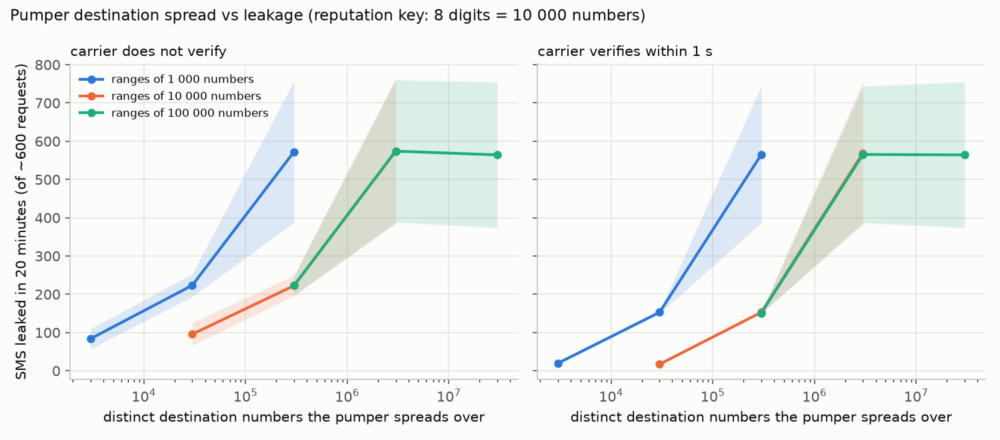

# Evaluation

Generated by `scripts/run_evaluation.py`: 6713 simulation runs, 30 seeds for the main study and 10 for sweeps, 2861 s wall time. Values are means with 95 % t-confidence intervals in brackets. Metric definitions and limitations: `docs/evaluation.md`.

Each run: 10 minutes of legitimate-only warm-up, then 20 minutes of attack with legitimate traffic (20 requests/min, 80 % conversion, verification delay lognormal median 25 s) in the background. Per seed the attacker's pool size (500 to 50 000 addresses), rate (10 to 60 requests/min) and CAPTCHA score class are randomised. Modes: **behavioural only** lifts the source caps so the other layers are visible; **with source caps** runs the source cap at 3x the legitimate rate: adaptive (baseline job and known-good exemption) for v2, static for v1, since the adaptive cap is v2's Step 9 and is behind the `adaptive_caps` flag.

## A. Attacker profiles across designs

Designs: `v1` (header-trusted platform, static caps); `v1_corrected` (v1 with attestation-derived platform); `budget_only` (attestation, sessions, static caps and the hard hourly budget, no scoring); `block_limit_only` (attestation, sessions, a flat 5-sends-per-destination-block-per-day limit, no scoring); `conversion_only` and `speed_only` (v2 with one of the two block tests off); `v2`.

Columns: *contained* is the fraction of seeds in which leakage fell to 5 % of the attack rate and stayed there to the end of the run; *time to containment* is the mean over contained seeds only (uncontained runs are censored at 20 min and excluded); *late leak* is the mean leakage per minute after containment, or over the final five minutes of an uncontained run. Legitimate outcomes: *dispatched* (a channel was chosen), *delivered* (provider receipt), *completed* (code entered); *refused* includes undelivered sends. *First-time refused* is the refusal rate among clients without verified history.

### Mode: behavioural only

| Attacker | Design | Contained | Time to containment if contained (min) | Late leak (SMS/min) | Total leaked / 20 min | Defender cost (USD) | Legit dispatched % | Legit delivered % | Legit completed % | Legit challenged % | Legit refused % | First-time refused % | Returning refused % |
|---|---|---:|---:|---:|---:|---:|---:|---:|---:|---:|---:|---:|---:|
| `naive_single_client` | v1 | 0.63 | 11.5 [7.7, 15.3] | 1.2 [0.8, 1.6] | 28 [20, 35] | 4.0 [3.0, 5.1] | 99.5 [99.3, 99.6] | 99.6 [99.5, 99.8] | 82.4 [81.5, 83.3] | 0.0 [0.0, 0.0] | 0.5 [0.4, 0.7] | 0.6 [0.4, 0.7] | 0.4 [0.2, 0.7] |
| `naive_single_client` | v1_corrected | 0.63 | 11.5 [7.7, 15.3] | 1.2 [0.8, 1.6] | 28 [20, 35] | 4.0 [3.0, 5.1] | 99.5 [99.3, 99.6] | 99.6 [99.5, 99.8] | 82.4 [81.5, 83.3] | 0.0 [0.0, 0.0] | 0.5 [0.4, 0.7] | 0.6 [0.4, 0.7] | 0.4 [0.2, 0.7] |
| `naive_single_client` | budget_only | 1.00 | 2.7 [0.9, 4.4] | 0.0 [0.0, 0.1] | 2 [1, 2] | 0.2 [0.2, 0.3] | 99.5 [99.3, 99.6] | 99.6 [99.5, 99.8] | 82.4 [81.5, 83.3] | 0.0 [0.0, 0.0] | 0.5 [0.4, 0.7] | 0.6 [0.4, 0.7] | 0.4 [0.2, 0.7] |
| `naive_single_client` | block_limit_only | 1.00 | 2.7 [0.9, 4.4] | 0.0 [0.0, 0.1] | 2 [1, 2] | 0.2 [0.2, 0.3] | 99.5 [99.3, 99.6] | 99.6 [99.5, 99.8] | 82.4 [81.5, 83.3] | 0.0 [0.0, 0.0] | 0.5 [0.4, 0.7] | 0.6 [0.4, 0.7] | 0.4 [0.2, 0.7] |
| `naive_single_client` | conversion_only | 1.00 | 2.5 [0.9, 4.1] | 0.0 [0.0, 0.1] | 2 [1, 3] | 0.3 [0.2, 0.4] | 99.3 [99.1, 99.5] | 99.7 [99.5, 99.8] | 81.0 [80.1, 81.9] | 1.5 [1.3, 1.6] | 0.7 [0.5, 0.9] | 0.7 [0.5, 0.9] | 0.7 [0.4, 0.9] |
| `naive_single_client` | speed_only | 1.00 | 2.5 [0.9, 4.1] | 0.0 [0.0, 0.1] | 2 [1, 3] | 0.3 [0.2, 0.4] | 99.3 [99.1, 99.5] | 99.7 [99.5, 99.8] | 81.0 [80.1, 81.9] | 1.5 [1.3, 1.6] | 0.7 [0.5, 0.9] | 0.7 [0.5, 0.9] | 0.7 [0.4, 0.9] |
| `naive_single_client` | v2 | 1.00 | 2.5 [0.9, 4.1] | 0.0 [0.0, 0.1] | 2 [1, 3] | 0.3 [0.2, 0.4] | 99.3 [99.1, 99.5] | 99.7 [99.5, 99.8] | 81.0 [80.1, 81.9] | 1.5 [1.3, 1.6] | 0.7 [0.5, 0.9] | 0.7 [0.5, 0.9] | 0.7 [0.4, 0.9] |
| `datacenter_rotation` | v1 | 0.10 | 18.0 [15.5, 20.5] | 20.2 [14.7, 25.7] | 410 [303, 517] | 58.9 [43.7, 74.2] | 99.4 [99.2, 99.5] | 99.6 [99.4, 99.7] | 81.3 [80.5, 82.1] | 0.0 [0.0, 0.0] | 0.6 [0.5, 0.8] | 0.6 [0.4, 0.8] | 0.6 [0.3, 0.9] |
| `datacenter_rotation` | v1_corrected | 0.10 | 18.0 [15.5, 20.5] | 20.2 [14.7, 25.7] | 410 [303, 517] | 58.9 [43.7, 74.2] | 99.4 [99.2, 99.5] | 99.6 [99.4, 99.7] | 81.3 [80.5, 82.1] | 0.0 [0.0, 0.0] | 0.6 [0.5, 0.8] | 0.6 [0.4, 0.8] | 0.6 [0.3, 0.9] |
| `datacenter_rotation` | budget_only | 0.10 | 18.0 [15.5, 20.5] | 20.2 [14.7, 25.7] | 410 [303, 517] | 58.9 [43.7, 74.2] | 99.4 [99.2, 99.5] | 99.6 [99.4, 99.7] | 81.3 [80.5, 82.1] | 0.0 [0.0, 0.0] | 0.6 [0.5, 0.8] | 0.6 [0.4, 0.8] | 0.6 [0.3, 0.9] |
| `datacenter_rotation` | block_limit_only | 0.10 | 18.0 [15.5, 20.5] | 20.2 [14.7, 25.7] | 410 [303, 517] | 58.9 [43.7, 74.2] | 99.4 [99.2, 99.5] | 99.6 [99.4, 99.7] | 81.3 [80.5, 82.1] | 0.0 [0.0, 0.0] | 0.6 [0.5, 0.8] | 0.6 [0.4, 0.8] | 0.6 [0.3, 0.9] |
| `datacenter_rotation` | conversion_only | 1.00 | 0.0 [0.0, 0.0] | 0.0 [0.0, 0.0] | 0 [0, 0] | 3.7 [2.8, 4.6] | 99.2 [99.1, 99.4] | 99.6 [99.4, 99.8] | 80.7 [79.8, 81.6] | 1.8 [1.5, 2.1] | 0.8 [0.6, 0.9] | 0.8 [0.6, 1.1] | 0.4 [0.1, 0.7] |
| `datacenter_rotation` | speed_only | 1.00 | 0.0 [0.0, 0.0] | 0.0 [0.0, 0.0] | 0 [0, 0] | 3.7 [2.8, 4.6] | 99.2 [99.1, 99.4] | 99.6 [99.4, 99.8] | 80.7 [79.8, 81.6] | 1.8 [1.5, 2.1] | 0.8 [0.6, 0.9] | 0.8 [0.6, 1.1] | 0.4 [0.1, 0.7] |
| `datacenter_rotation` | v2 | 1.00 | 0.0 [0.0, 0.0] | 0.0 [0.0, 0.0] | 0 [0, 0] | 3.7 [2.8, 4.6] | 99.2 [99.1, 99.4] | 99.6 [99.4, 99.8] | 80.7 [79.8, 81.6] | 1.8 [1.5, 2.1] | 0.8 [0.6, 0.9] | 0.8 [0.6, 1.1] | 0.4 [0.1, 0.7] |
| `residential_bot` | v1 | 0.13 | 17.8 [16.2, 19.3] | 10.4 [7.4, 13.4] | 217 [158, 277] | 31.4 [22.9, 40.0] | 99.3 [99.2, 99.5] | 99.5 [99.4, 99.7] | 81.3 [80.6, 82.1] | 0.0 [0.0, 0.0] | 0.7 [0.5, 0.8] | 0.6 [0.4, 0.8] | 0.7 [0.4, 1.1] |
| `residential_bot` | v1_corrected | 0.13 | 17.8 [16.2, 19.3] | 10.4 [7.4, 13.4] | 217 [158, 277] | 31.4 [22.9, 40.0] | 99.3 [99.2, 99.5] | 99.5 [99.4, 99.7] | 81.3 [80.6, 82.1] | 0.0 [0.0, 0.0] | 0.7 [0.5, 0.8] | 0.6 [0.4, 0.8] | 0.7 [0.4, 1.1] |
| `residential_bot` | budget_only | 0.13 | 17.8 [16.2, 19.3] | 10.4 [7.4, 13.4] | 217 [158, 277] | 31.4 [22.9, 40.0] | 99.3 [99.2, 99.5] | 99.5 [99.4, 99.7] | 81.3 [80.6, 82.1] | 0.0 [0.0, 0.0] | 0.7 [0.5, 0.8] | 0.6 [0.4, 0.8] | 0.7 [0.4, 1.1] |
| `residential_bot` | block_limit_only | 0.13 | 17.8 [16.2, 19.3] | 10.4 [7.4, 13.4] | 217 [158, 277] | 31.4 [22.9, 40.0] | 99.3 [99.2, 99.5] | 99.5 [99.4, 99.7] | 81.3 [80.6, 82.1] | 0.0 [0.0, 0.0] | 0.7 [0.5, 0.8] | 0.6 [0.4, 0.8] | 0.7 [0.4, 1.1] |
| `residential_bot` | conversion_only | 0.20 | 18.3 [17.5, 19.2] | 10.3 [7.2, 13.3] | 214 [156, 272] | 32.7 [24.0, 41.4] | 99.3 [99.1, 99.4] | 99.7 [99.5, 99.8] | 81.0 [80.3, 81.7] | 1.6 [1.4, 1.8] | 0.7 [0.6, 0.9] | 0.8 [0.6, 1.0] | 0.4 [0.1, 0.6] |
| `residential_bot` | speed_only | 0.20 | 18.3 [17.5, 19.2] | 10.3 [7.2, 13.3] | 214 [156, 272] | 32.7 [24.0, 41.4] | 99.3 [99.1, 99.4] | 99.7 [99.5, 99.8] | 81.0 [80.3, 81.7] | 1.6 [1.4, 1.8] | 0.7 [0.6, 0.9] | 0.8 [0.6, 1.0] | 0.4 [0.1, 0.6] |
| `residential_bot` | v2 | 0.20 | 18.3 [17.5, 19.2] | 10.3 [7.2, 13.3] | 214 [156, 272] | 32.7 [24.0, 41.4] | 99.3 [99.1, 99.4] | 99.7 [99.5, 99.8] | 81.0 [80.3, 81.7] | 1.6 [1.4, 1.8] | 0.7 [0.6, 0.9] | 0.8 [0.6, 1.0] | 0.4 [0.1, 0.6] |
| `residential_captcha_farm` | v1 | 0.00 | n/a | 29.2 [24.2, 34.2] | 591 [497, 685] | 84.6 [71.2, 98.1] | 99.4 [99.3, 99.5] | 99.6 [99.5, 99.7] | 81.0 [80.2, 81.8] | 0.0 [0.0, 0.0] | 0.6 [0.5, 0.7] | 0.6 [0.4, 0.7] | 0.5 [0.2, 0.8] |
| `residential_captcha_farm` | v1_corrected | 0.00 | n/a | 29.2 [24.2, 34.2] | 591 [497, 685] | 84.6 [71.2, 98.1] | 99.4 [99.3, 99.5] | 99.6 [99.5, 99.7] | 81.0 [80.2, 81.8] | 0.0 [0.0, 0.0] | 0.6 [0.5, 0.7] | 0.6 [0.4, 0.7] | 0.5 [0.2, 0.8] |
| `residential_captcha_farm` | budget_only | 0.00 | n/a | 29.2 [24.2, 34.2] | 591 [497, 685] | 84.6 [71.2, 98.1] | 99.4 [99.3, 99.5] | 99.6 [99.5, 99.7] | 81.0 [80.2, 81.8] | 0.0 [0.0, 0.0] | 0.6 [0.5, 0.7] | 0.6 [0.4, 0.7] | 0.5 [0.2, 0.8] |
| `residential_captcha_farm` | block_limit_only | 0.00 | n/a | 29.2 [24.2, 34.2] | 591 [497, 685] | 84.6 [71.2, 98.1] | 99.4 [99.3, 99.5] | 99.6 [99.5, 99.7] | 81.0 [80.2, 81.8] | 0.0 [0.0, 0.0] | 0.6 [0.5, 0.7] | 0.6 [0.4, 0.7] | 0.5 [0.2, 0.8] |
| `residential_captcha_farm` | conversion_only | 0.00 | n/a | 29.7 [24.5, 34.8] | 595 [496, 694] | 89.9 [75.0, 104.9] | 99.2 [99.0, 99.4] | 99.6 [99.4, 99.8] | 80.9 [80.1, 81.7] | 1.8 [1.5, 2.1] | 0.8 [0.6, 1.0] | 0.8 [0.6, 1.1] | 0.5 [0.3, 0.7] |
| `residential_captcha_farm` | speed_only | 0.00 | n/a | 29.7 [24.5, 34.8] | 595 [496, 694] | 89.9 [75.0, 104.9] | 99.2 [99.0, 99.4] | 99.6 [99.4, 99.8] | 80.9 [80.1, 81.7] | 1.8 [1.5, 2.1] | 0.8 [0.6, 1.0] | 0.8 [0.6, 1.1] | 0.5 [0.3, 0.7] |
| `residential_captcha_farm` | v2 | 0.00 | n/a | 29.7 [24.5, 34.8] | 595 [496, 694] | 89.9 [75.0, 104.9] | 99.2 [99.0, 99.4] | 99.6 [99.4, 99.8] | 80.9 [80.1, 81.7] | 1.8 [1.5, 2.1] | 0.8 [0.6, 1.0] | 0.8 [0.6, 1.1] | 0.5 [0.3, 0.7] |
| `residential_aged_fps` | v1 | 0.00 | n/a | 29.2 [24.2, 34.2] | 591 [497, 685] | 84.6 [71.2, 98.1] | 99.4 [99.3, 99.5] | 99.6 [99.5, 99.7] | 81.0 [80.2, 81.8] | 0.0 [0.0, 0.0] | 0.6 [0.5, 0.7] | 0.6 [0.4, 0.7] | 0.5 [0.2, 0.8] |
| `residential_aged_fps` | v1_corrected | 0.00 | n/a | 29.2 [24.2, 34.2] | 591 [497, 685] | 84.6 [71.2, 98.1] | 99.4 [99.3, 99.5] | 99.6 [99.5, 99.7] | 81.0 [80.2, 81.8] | 0.0 [0.0, 0.0] | 0.6 [0.5, 0.7] | 0.6 [0.4, 0.7] | 0.5 [0.2, 0.8] |
| `residential_aged_fps` | budget_only | 0.00 | n/a | 29.2 [24.2, 34.2] | 591 [497, 685] | 84.6 [71.2, 98.1] | 99.4 [99.3, 99.5] | 99.6 [99.5, 99.7] | 81.0 [80.2, 81.8] | 0.0 [0.0, 0.0] | 0.6 [0.5, 0.7] | 0.6 [0.4, 0.7] | 0.5 [0.2, 0.8] |
| `residential_aged_fps` | block_limit_only | 0.00 | n/a | 29.2 [24.2, 34.2] | 591 [497, 685] | 84.6 [71.2, 98.1] | 99.4 [99.3, 99.5] | 99.6 [99.5, 99.7] | 81.0 [80.2, 81.8] | 0.0 [0.0, 0.0] | 0.6 [0.5, 0.7] | 0.6 [0.4, 0.7] | 0.5 [0.2, 0.8] |
| `residential_aged_fps` | conversion_only | 0.00 | n/a | 29.7 [24.5, 34.8] | 595 [496, 694] | 89.9 [75.0, 104.9] | 99.2 [99.0, 99.4] | 99.6 [99.4, 99.8] | 80.9 [80.1, 81.7] | 1.8 [1.5, 2.1] | 0.8 [0.6, 1.0] | 0.8 [0.6, 1.1] | 0.5 [0.3, 0.7] |
| `residential_aged_fps` | speed_only | 0.00 | n/a | 29.7 [24.5, 34.8] | 595 [496, 694] | 89.9 [75.0, 104.9] | 99.2 [99.0, 99.4] | 99.6 [99.4, 99.8] | 80.9 [80.1, 81.7] | 1.8 [1.5, 2.1] | 0.8 [0.6, 1.0] | 0.8 [0.6, 1.1] | 0.5 [0.3, 0.7] |
| `residential_aged_fps` | v2 | 0.00 | n/a | 29.7 [24.5, 34.8] | 595 [496, 694] | 89.9 [75.0, 104.9] | 99.2 [99.0, 99.4] | 99.6 [99.4, 99.8] | 80.9 [80.1, 81.7] | 1.8 [1.5, 2.1] | 0.8 [0.6, 1.0] | 0.8 [0.6, 1.1] | 0.5 [0.3, 0.7] |
| `residential_reused_profile` | v1 | 0.00 | n/a | 29.7 [24.6, 34.7] | 591 [494, 687] | 84.6 [70.8, 98.4] | 99.5 [99.4, 99.7] | 99.7 [99.5, 99.9] | 81.3 [80.3, 82.2] | 0.0 [0.0, 0.0] | 0.5 [0.3, 0.6] | 0.5 [0.3, 0.6] | 0.7 [0.3, 1.1] |
| `residential_reused_profile` | v1_corrected | 0.00 | n/a | 29.7 [24.6, 34.7] | 591 [494, 687] | 84.6 [70.8, 98.4] | 99.5 [99.4, 99.7] | 99.7 [99.5, 99.9] | 81.3 [80.3, 82.2] | 0.0 [0.0, 0.0] | 0.5 [0.3, 0.6] | 0.5 [0.3, 0.6] | 0.7 [0.3, 1.1] |
| `residential_reused_profile` | budget_only | 0.00 | n/a | 29.7 [24.6, 34.7] | 591 [494, 687] | 84.6 [70.8, 98.4] | 99.5 [99.4, 99.7] | 99.7 [99.5, 99.9] | 81.3 [80.3, 82.2] | 0.0 [0.0, 0.0] | 0.5 [0.3, 0.6] | 0.5 [0.3, 0.6] | 0.7 [0.3, 1.1] |
| `residential_reused_profile` | block_limit_only | 0.00 | n/a | 29.7 [24.6, 34.7] | 591 [494, 687] | 84.6 [70.8, 98.4] | 99.5 [99.4, 99.7] | 99.7 [99.5, 99.9] | 81.3 [80.3, 82.2] | 0.0 [0.0, 0.0] | 0.5 [0.3, 0.6] | 0.5 [0.3, 0.6] | 0.7 [0.3, 1.1] |
| `residential_reused_profile` | conversion_only | 1.00 | 4.7 [4.3, 5.1] | 0.0 [0.0, 0.0] | 128 [112, 144] | 19.4 [17.0, 21.8] | 99.3 [99.2, 99.5] | 99.7 [99.5, 99.8] | 81.2 [80.4, 81.9] | 1.6 [1.4, 1.9] | 0.7 [0.5, 0.8] | 0.7 [0.5, 0.9] | 0.6 [0.3, 0.9] |
| `residential_reused_profile` | speed_only | 1.00 | 4.7 [4.3, 5.1] | 0.0 [0.0, 0.0] | 128 [112, 144] | 19.4 [17.0, 21.8] | 99.3 [99.2, 99.5] | 99.7 [99.5, 99.8] | 81.2 [80.4, 81.9] | 1.6 [1.4, 1.9] | 0.7 [0.5, 0.8] | 0.7 [0.5, 0.9] | 0.6 [0.3, 0.9] |
| `residential_reused_profile` | v2 | 1.00 | 4.7 [4.3, 5.1] | 0.0 [0.0, 0.0] | 128 [112, 144] | 19.4 [17.0, 21.8] | 99.3 [99.2, 99.5] | 99.7 [99.5, 99.8] | 81.2 [80.4, 81.9] | 1.6 [1.4, 1.9] | 0.7 [0.5, 0.8] | 0.7 [0.5, 0.9] | 0.6 [0.3, 0.9] |
| `sequential_numbers` | v1 | 0.00 | n/a | 29.5 [24.9, 34.1] | 596 [497, 695] | 85.3 [71.1, 99.6] | 99.4 [99.3, 99.6] | 99.6 [99.5, 99.8] | 81.1 [80.2, 82.0] | 0.0 [0.0, 0.0] | 0.6 [0.4, 0.7] | 0.6 [0.4, 0.7] | 0.6 [0.2, 0.9] |
| `sequential_numbers` | v1_corrected | 0.00 | n/a | 29.5 [24.9, 34.1] | 596 [497, 695] | 85.3 [71.1, 99.6] | 99.4 [99.3, 99.6] | 99.6 [99.5, 99.8] | 81.1 [80.2, 82.0] | 0.0 [0.0, 0.0] | 0.6 [0.4, 0.7] | 0.6 [0.4, 0.7] | 0.6 [0.2, 0.9] |
| `sequential_numbers` | budget_only | 0.00 | n/a | 29.5 [24.9, 34.1] | 596 [497, 695] | 85.3 [71.1, 99.6] | 99.4 [99.3, 99.6] | 99.6 [99.5, 99.8] | 81.1 [80.2, 82.0] | 0.0 [0.0, 0.0] | 0.6 [0.4, 0.7] | 0.6 [0.4, 0.7] | 0.6 [0.2, 0.9] |
| `sequential_numbers` | block_limit_only | 1.00 | 1.0 [1.0, 1.0] | 0.0 [0.0, 0.0] | 5 [5, 5] | 1.3 [1.2, 1.4] | 99.4 [99.3, 99.6] | 99.6 [99.4, 99.8] | 81.1 [80.2, 81.9] | 0.0 [0.0, 0.0] | 0.6 [0.4, 0.7] | 0.6 [0.4, 0.7] | 0.6 [0.2, 1.0] |
| `sequential_numbers` | conversion_only | 1.00 | 3.0 [3.0, 3.0] | 0.0 [0.0, 0.0] | 71 [60, 83] | 15.5 [13.0, 18.0] | 99.3 [99.1, 99.4] | 99.7 [99.5, 99.8] | 81.5 [80.6, 82.5] | 1.6 [1.3, 1.8] | 0.7 [0.6, 0.9] | 0.7 [0.6, 0.9] | 0.7 [0.3, 1.0] |
| `sequential_numbers` | speed_only | 1.00 | 3.5 [3.2, 3.7] | 0.0 [0.0, 0.0] | 78 [68, 87] | 16.4 [14.2, 18.6] | 99.3 [99.1, 99.5] | 99.7 [99.5, 99.8] | 81.5 [80.6, 82.5] | 1.6 [1.3, 1.9] | 0.7 [0.5, 0.9] | 0.7 [0.5, 0.9] | 0.7 [0.3, 1.0] |
| `sequential_numbers` | v2 | 1.00 | 3.0 [3.0, 3.0] | 0.0 [0.0, 0.0] | 71 [60, 83] | 15.5 [13.0, 18.0] | 99.3 [99.1, 99.4] | 99.7 [99.5, 99.8] | 81.5 [80.6, 82.5] | 1.6 [1.3, 1.8] | 0.7 [0.6, 0.9] | 0.7 [0.6, 0.9] | 0.7 [0.3, 1.0] |
| `premium_pumping` | v1 | 0.20 | 16.3 [14.4, 18.3] | 20.1 [15.2, 24.9] | 554 [478, 629] | 79.3 [68.5, 90.2] | 98.4 [97.5, 99.3] | 98.6 [97.6, 99.5] | 80.3 [79.4, 81.3] | 0.0 [0.0, 0.0] | 1.6 [0.7, 2.5] | 1.6 [0.7, 2.5] | 1.7 [0.4, 2.9] |
| `premium_pumping` | v1_corrected | 0.20 | 16.3 [14.4, 18.3] | 20.1 [15.2, 24.9] | 554 [478, 629] | 79.3 [68.5, 90.2] | 98.4 [97.5, 99.3] | 98.6 [97.6, 99.5] | 80.3 [79.4, 81.3] | 0.0 [0.0, 0.0] | 1.6 [0.7, 2.5] | 1.6 [0.7, 2.5] | 1.7 [0.4, 2.9] |
| `premium_pumping` | budget_only | 0.20 | 16.5 [14.7, 18.3] | 19.8 [15.1, 24.6] | 553 [477, 628] | 79.2 [68.4, 90.0] | 97.6 [96.2, 98.9] | 97.7 [96.4, 99.1] | 79.4 [78.1, 80.8] | 0.0 [0.0, 0.0] | 2.4 [1.1, 3.8] | 2.5 [1.1, 3.8] | 2.3 [0.7, 3.8] |
| `premium_pumping` | block_limit_only | 1.00 | 1.0 [1.0, 1.0] | 0.0 [0.0, 0.0] | 5 [5, 5] | 1.3 [1.2, 1.4] | 99.4 [99.3, 99.6] | 99.6 [99.5, 99.8] | 81.1 [80.2, 82.0] | 0.0 [0.0, 0.0] | 0.6 [0.4, 0.7] | 0.6 [0.4, 0.7] | 0.6 [0.2, 0.9] |
| `premium_pumping` | conversion_only | 1.00 | 0.0 [0.0, 0.0] | 0.0 [0.0, 0.0] | 0 [0, 0] | 0.6 [0.5, 0.7] | 99.3 [99.2, 99.5] | 99.7 [99.5, 99.8] | 81.5 [80.6, 82.4] | 1.5 [1.2, 1.7] | 0.7 [0.5, 0.8] | 0.7 [0.5, 0.9] | 0.6 [0.3, 0.9] |
| `premium_pumping` | speed_only | 1.00 | 0.0 [0.0, 0.0] | 0.0 [0.0, 0.0] | 0 [0, 0] | 0.6 [0.5, 0.7] | 99.3 [99.2, 99.5] | 99.7 [99.5, 99.8] | 81.5 [80.6, 82.4] | 1.5 [1.2, 1.7] | 0.7 [0.5, 0.8] | 0.7 [0.5, 0.9] | 0.6 [0.3, 0.9] |
| `premium_pumping` | v2 | 1.00 | 0.0 [0.0, 0.0] | 0.0 [0.0, 0.0] | 0 [0, 0] | 0.6 [0.5, 0.7] | 99.3 [99.2, 99.5] | 99.7 [99.5, 99.8] | 81.5 [80.6, 82.4] | 1.5 [1.2, 1.7] | 0.7 [0.5, 0.8] | 0.7 [0.5, 0.9] | 0.6 [0.3, 0.9] |
| `spoofed_platform` | v1 | 0.00 | n/a | 29.3 [24.3, 34.4] | 594 [499, 688] | 84.4 [71.0, 97.8] | 99.4 [99.3, 99.5] | 99.6 [99.5, 99.7] | 81.0 [80.2, 81.8] | 0.0 [0.0, 0.0] | 0.6 [0.5, 0.7] | 0.6 [0.4, 0.7] | 0.5 [0.2, 0.8] |
| `spoofed_platform` | v1_corrected | 0.00 | n/a | 29.2 [24.2, 34.2] | 591 [497, 685] | 84.6 [71.2, 98.1] | 99.4 [99.3, 99.5] | 99.6 [99.5, 99.7] | 81.0 [80.2, 81.8] | 0.0 [0.0, 0.0] | 0.6 [0.5, 0.7] | 0.6 [0.4, 0.7] | 0.5 [0.2, 0.8] |
| `spoofed_platform` | budget_only | 0.00 | n/a | 29.2 [24.2, 34.2] | 591 [497, 685] | 84.6 [71.2, 98.1] | 99.4 [99.3, 99.5] | 99.6 [99.5, 99.7] | 81.0 [80.2, 81.8] | 0.0 [0.0, 0.0] | 0.6 [0.5, 0.7] | 0.6 [0.4, 0.7] | 0.5 [0.2, 0.8] |
| `spoofed_platform` | block_limit_only | 0.00 | n/a | 29.2 [24.2, 34.2] | 591 [497, 685] | 84.6 [71.2, 98.1] | 99.4 [99.3, 99.5] | 99.6 [99.5, 99.7] | 81.0 [80.2, 81.8] | 0.0 [0.0, 0.0] | 0.6 [0.5, 0.7] | 0.6 [0.4, 0.7] | 0.5 [0.2, 0.8] |
| `spoofed_platform` | conversion_only | 0.00 | n/a | 29.7 [24.5, 34.8] | 595 [496, 694] | 89.9 [75.0, 104.9] | 99.2 [99.0, 99.4] | 99.6 [99.4, 99.8] | 80.9 [80.1, 81.7] | 1.8 [1.5, 2.1] | 0.8 [0.6, 1.0] | 0.8 [0.6, 1.1] | 0.5 [0.3, 0.7] |
| `spoofed_platform` | speed_only | 0.00 | n/a | 29.7 [24.5, 34.8] | 595 [496, 694] | 89.9 [75.0, 104.9] | 99.2 [99.0, 99.4] | 99.6 [99.4, 99.8] | 80.9 [80.1, 81.7] | 1.8 [1.5, 2.1] | 0.8 [0.6, 1.0] | 0.8 [0.6, 1.1] | 0.5 [0.3, 0.7] |
| `spoofed_platform` | v2 | 0.00 | n/a | 29.7 [24.5, 34.8] | 595 [496, 694] | 89.9 [75.0, 104.9] | 99.2 [99.0, 99.4] | 99.6 [99.4, 99.8] | 80.9 [80.1, 81.7] | 1.8 [1.5, 2.1] | 0.8 [0.6, 1.0] | 0.8 [0.6, 1.1] | 0.5 [0.3, 0.7] |

### Mode: with adaptive caps

| Attacker | Design | Contained | Time to containment if contained (min) | Late leak (SMS/min) | Total leaked / 20 min | Defender cost (USD) | Legit dispatched % | Legit delivered % | Legit completed % | Legit challenged % | Legit refused % | First-time refused % | Returning refused % |
|---|---|---:|---:|---:|---:|---:|---:|---:|---:|---:|---:|---:|---:|
| `naive_single_client` | v1 | 0.63 | 11.5 [7.7, 15.3] | 1.2 [0.8, 1.6] | 28 [20, 35] | 4.0 [3.0, 5.1] | 99.0 [98.2, 99.9] | 99.2 [98.4, 100.1] | 82.1 [81.0, 83.2] | 0.0 [0.0, 0.0] | 1.0 [0.1, 1.8] | 1.0 [0.2, 1.8] | 0.9 [0.0, 2.0] |
| `naive_single_client` | v1_corrected | 0.63 | 11.5 [7.7, 15.3] | 1.2 [0.8, 1.6] | 28 [20, 35] | 4.0 [3.0, 5.1] | 99.0 [98.2, 99.9] | 99.2 [98.4, 100.1] | 82.1 [81.0, 83.2] | 0.0 [0.0, 0.0] | 1.0 [0.1, 1.8] | 1.0 [0.2, 1.8] | 0.9 [0.0, 2.0] |
| `naive_single_client` | budget_only | 1.00 | 2.7 [0.9, 4.4] | 0.0 [0.0, 0.1] | 2 [1, 2] | 0.2 [0.2, 0.3] | 99.0 [98.2, 99.9] | 99.2 [98.4, 100.1] | 82.1 [81.0, 83.2] | 0.0 [0.0, 0.0] | 1.0 [0.1, 1.8] | 1.0 [0.2, 1.8] | 0.9 [0.0, 2.0] |
| `naive_single_client` | block_limit_only | 1.00 | 2.7 [0.9, 4.4] | 0.0 [0.0, 0.1] | 2 [1, 2] | 0.2 [0.2, 0.3] | 99.0 [98.2, 99.9] | 99.2 [98.4, 100.1] | 82.1 [81.0, 83.2] | 0.0 [0.0, 0.0] | 1.0 [0.1, 1.8] | 1.0 [0.2, 1.8] | 0.9 [0.0, 2.0] |
| `naive_single_client` | conversion_only | 1.00 | 2.5 [0.9, 4.1] | 0.0 [0.0, 0.1] | 2 [1, 3] | 0.3 [0.2, 0.4] | 99.3 [99.1, 99.5] | 99.7 [99.5, 99.8] | 81.0 [80.1, 81.9] | 1.5 [1.3, 1.6] | 0.7 [0.5, 0.9] | 0.7 [0.5, 0.9] | 0.7 [0.4, 0.9] |
| `naive_single_client` | speed_only | 1.00 | 2.5 [0.9, 4.1] | 0.0 [0.0, 0.1] | 2 [1, 3] | 0.3 [0.2, 0.4] | 99.3 [99.1, 99.5] | 99.7 [99.5, 99.8] | 81.0 [80.1, 81.9] | 1.5 [1.3, 1.6] | 0.7 [0.5, 0.9] | 0.7 [0.5, 0.9] | 0.7 [0.4, 0.9] |
| `naive_single_client` | v2 | 1.00 | 2.5 [0.9, 4.1] | 0.0 [0.0, 0.1] | 2 [1, 3] | 0.3 [0.2, 0.4] | 99.3 [99.1, 99.5] | 99.7 [99.5, 99.8] | 81.0 [80.1, 81.9] | 1.5 [1.3, 1.6] | 0.7 [0.5, 0.9] | 0.7 [0.5, 0.9] | 0.7 [0.4, 0.9] |
| `datacenter_rotation` | v1 | 0.10 | 18.0 [15.5, 20.5] | 19.4 [14.4, 24.3] | 396 [299, 493] | 56.9 [43.0, 70.7] | 97.8 [96.3, 99.3] | 98.0 [96.5, 99.4] | 80.1 [78.8, 81.5] | 0.0 [0.0, 0.0] | 2.2 [0.7, 3.7] | 2.2 [0.7, 3.7] | 2.1 [0.6, 3.6] |
| `datacenter_rotation` | v1_corrected | 0.10 | 18.0 [15.5, 20.5] | 19.4 [14.4, 24.3] | 396 [299, 493] | 56.9 [43.0, 70.7] | 97.8 [96.3, 99.3] | 98.0 [96.5, 99.4] | 80.1 [78.8, 81.5] | 0.0 [0.0, 0.0] | 2.2 [0.7, 3.7] | 2.2 [0.7, 3.7] | 2.1 [0.6, 3.6] |
| `datacenter_rotation` | budget_only | 0.10 | 18.0 [15.5, 20.5] | 19.4 [14.4, 24.3] | 396 [299, 493] | 56.9 [43.0, 70.7] | 97.8 [96.3, 99.3] | 98.0 [96.5, 99.4] | 80.1 [78.8, 81.5] | 0.0 [0.0, 0.0] | 2.2 [0.7, 3.7] | 2.2 [0.7, 3.7] | 2.1 [0.6, 3.6] |
| `datacenter_rotation` | block_limit_only | 0.10 | 18.0 [15.5, 20.5] | 19.4 [14.4, 24.3] | 396 [299, 493] | 56.9 [43.0, 70.7] | 97.8 [96.3, 99.3] | 98.0 [96.5, 99.4] | 80.1 [78.8, 81.5] | 0.0 [0.0, 0.0] | 2.2 [0.7, 3.7] | 2.2 [0.7, 3.7] | 2.1 [0.6, 3.6] |
| `datacenter_rotation` | conversion_only | 1.00 | 0.0 [0.0, 0.0] | 0.0 [0.0, 0.0] | 0 [0, 0] | 3.7 [2.8, 4.6] | 99.2 [99.1, 99.4] | 99.6 [99.4, 99.8] | 80.7 [79.8, 81.6] | 1.8 [1.5, 2.1] | 0.8 [0.6, 0.9] | 0.8 [0.6, 1.1] | 0.4 [0.1, 0.7] |
| `datacenter_rotation` | speed_only | 1.00 | 0.0 [0.0, 0.0] | 0.0 [0.0, 0.0] | 0 [0, 0] | 3.7 [2.8, 4.6] | 99.2 [99.1, 99.4] | 99.6 [99.4, 99.8] | 80.7 [79.8, 81.6] | 1.8 [1.5, 2.1] | 0.8 [0.6, 0.9] | 0.8 [0.6, 1.1] | 0.4 [0.1, 0.7] |
| `datacenter_rotation` | v2 | 1.00 | 0.0 [0.0, 0.0] | 0.0 [0.0, 0.0] | 0 [0, 0] | 3.7 [2.8, 4.6] | 99.2 [99.1, 99.4] | 99.6 [99.4, 99.8] | 80.7 [79.8, 81.6] | 1.8 [1.5, 2.1] | 0.8 [0.6, 0.9] | 0.8 [0.6, 1.1] | 0.4 [0.1, 0.7] |
| `residential_bot` | v1 | 0.13 | 17.8 [16.2, 19.3] | 10.4 [7.4, 13.4] | 217 [158, 277] | 31.4 [22.9, 40.0] | 99.3 [99.2, 99.5] | 99.5 [99.3, 99.7] | 81.3 [80.6, 82.1] | 0.0 [0.0, 0.0] | 0.7 [0.5, 0.8] | 0.7 [0.5, 0.9] | 0.7 [0.4, 1.1] |
| `residential_bot` | v1_corrected | 0.13 | 17.8 [16.2, 19.3] | 10.4 [7.4, 13.4] | 217 [158, 277] | 31.4 [22.9, 40.0] | 99.3 [99.2, 99.5] | 99.5 [99.3, 99.7] | 81.3 [80.6, 82.1] | 0.0 [0.0, 0.0] | 0.7 [0.5, 0.8] | 0.7 [0.5, 0.9] | 0.7 [0.4, 1.1] |
| `residential_bot` | budget_only | 0.13 | 17.8 [16.2, 19.3] | 10.4 [7.4, 13.4] | 217 [158, 277] | 31.4 [22.9, 40.0] | 99.3 [99.2, 99.5] | 99.5 [99.3, 99.7] | 81.3 [80.6, 82.1] | 0.0 [0.0, 0.0] | 0.7 [0.5, 0.8] | 0.7 [0.5, 0.9] | 0.7 [0.4, 1.1] |
| `residential_bot` | block_limit_only | 0.13 | 17.8 [16.2, 19.3] | 10.4 [7.4, 13.4] | 217 [158, 277] | 31.4 [22.9, 40.0] | 99.3 [99.2, 99.5] | 99.5 [99.3, 99.7] | 81.3 [80.6, 82.1] | 0.0 [0.0, 0.0] | 0.7 [0.5, 0.8] | 0.7 [0.5, 0.9] | 0.7 [0.4, 1.1] |
| `residential_bot` | conversion_only | 0.23 | 18.4 [17.7, 19.2] | 5.8 [4.6, 7.1] | 152 [124, 181] | 23.9 [19.5, 28.4] | 87.7 [81.4, 93.9] | 88.0 [81.8, 94.2] | 71.8 [66.8, 76.8] | 1.6 [1.4, 1.8] | 12.3 [6.1, 18.6] | 15.4 [7.6, 23.3] | 0.4 [0.1, 0.7] |
| `residential_bot` | speed_only | 0.23 | 18.4 [17.7, 19.2] | 5.8 [4.6, 7.1] | 152 [124, 181] | 23.9 [19.5, 28.4] | 87.7 [81.4, 93.9] | 88.0 [81.8, 94.2] | 71.8 [66.8, 76.8] | 1.6 [1.4, 1.8] | 12.3 [6.1, 18.6] | 15.4 [7.6, 23.3] | 0.4 [0.1, 0.7] |
| `residential_bot` | v2 | 0.23 | 18.4 [17.7, 19.2] | 5.8 [4.6, 7.1] | 152 [124, 181] | 23.9 [19.5, 28.4] | 87.7 [81.4, 93.9] | 88.0 [81.8, 94.2] | 71.8 [66.8, 76.8] | 1.6 [1.4, 1.8] | 12.3 [6.1, 18.6] | 15.4 [7.6, 23.3] | 0.4 [0.1, 0.7] |
| `residential_captcha_farm` | v1 | 0.00 | n/a | 27.4 [23.5, 31.4] | 563 [485, 641] | 80.7 [69.5, 91.8] | 96.2 [93.8, 98.6] | 96.4 [94.0, 98.8] | 78.8 [76.8, 80.8] | 0.0 [0.0, 0.0] | 3.8 [1.4, 6.2] | 3.8 [1.4, 6.2] | 3.6 [1.2, 6.1] |
| `residential_captcha_farm` | v1_corrected | 0.00 | n/a | 27.4 [23.5, 31.4] | 563 [485, 641] | 80.7 [69.5, 91.8] | 96.2 [93.8, 98.6] | 96.4 [94.0, 98.8] | 78.8 [76.8, 80.8] | 0.0 [0.0, 0.0] | 3.8 [1.4, 6.2] | 3.8 [1.4, 6.2] | 3.6 [1.2, 6.1] |
| `residential_captcha_farm` | budget_only | 0.00 | n/a | 27.4 [23.5, 31.4] | 563 [485, 641] | 80.7 [69.5, 91.8] | 96.2 [93.8, 98.6] | 96.4 [94.0, 98.8] | 78.8 [76.8, 80.8] | 0.0 [0.0, 0.0] | 3.8 [1.4, 6.2] | 3.8 [1.4, 6.2] | 3.6 [1.2, 6.1] |
| `residential_captcha_farm` | block_limit_only | 0.00 | n/a | 27.4 [23.5, 31.4] | 563 [485, 641] | 80.7 [69.5, 91.8] | 96.2 [93.8, 98.6] | 96.4 [94.0, 98.8] | 78.8 [76.8, 80.8] | 0.0 [0.0, 0.0] | 3.8 [1.4, 6.2] | 3.8 [1.4, 6.2] | 3.6 [1.2, 6.1] |
| `residential_captcha_farm` | conversion_only | 0.00 | n/a | 10.0 [9.3, 10.7] | 243 [230, 257] | 40.0 [37.3, 42.6] | 59.6 [52.9, 66.3] | 59.9 [53.2, 66.6] | 49.1 [43.6, 54.6] | 1.7 [1.4, 1.9] | 40.4 [33.7, 47.1] | 51.0 [42.5, 59.5] | 0.5 [0.2, 0.8] |
| `residential_captcha_farm` | speed_only | 0.00 | n/a | 10.0 [9.3, 10.7] | 243 [230, 257] | 40.0 [37.3, 42.6] | 59.6 [52.9, 66.3] | 59.9 [53.2, 66.6] | 49.1 [43.6, 54.6] | 1.7 [1.4, 1.9] | 40.4 [33.7, 47.1] | 51.0 [42.5, 59.5] | 0.5 [0.2, 0.8] |
| `residential_captcha_farm` | v2 | 0.00 | n/a | 10.0 [9.3, 10.7] | 243 [230, 257] | 40.0 [37.3, 42.6] | 59.6 [52.9, 66.3] | 59.9 [53.2, 66.6] | 49.1 [43.6, 54.6] | 1.7 [1.4, 1.9] | 40.4 [33.7, 47.1] | 51.0 [42.5, 59.5] | 0.5 [0.2, 0.8] |
| `residential_aged_fps` | v1 | 0.00 | n/a | 27.4 [23.5, 31.4] | 563 [485, 641] | 80.7 [69.5, 91.8] | 96.2 [93.8, 98.6] | 96.4 [94.0, 98.8] | 78.8 [76.8, 80.8] | 0.0 [0.0, 0.0] | 3.8 [1.4, 6.2] | 3.8 [1.4, 6.2] | 3.6 [1.2, 6.1] |
| `residential_aged_fps` | v1_corrected | 0.00 | n/a | 27.4 [23.5, 31.4] | 563 [485, 641] | 80.7 [69.5, 91.8] | 96.2 [93.8, 98.6] | 96.4 [94.0, 98.8] | 78.8 [76.8, 80.8] | 0.0 [0.0, 0.0] | 3.8 [1.4, 6.2] | 3.8 [1.4, 6.2] | 3.6 [1.2, 6.1] |
| `residential_aged_fps` | budget_only | 0.00 | n/a | 27.4 [23.5, 31.4] | 563 [485, 641] | 80.7 [69.5, 91.8] | 96.2 [93.8, 98.6] | 96.4 [94.0, 98.8] | 78.8 [76.8, 80.8] | 0.0 [0.0, 0.0] | 3.8 [1.4, 6.2] | 3.8 [1.4, 6.2] | 3.6 [1.2, 6.1] |
| `residential_aged_fps` | block_limit_only | 0.00 | n/a | 27.4 [23.5, 31.4] | 563 [485, 641] | 80.7 [69.5, 91.8] | 96.2 [93.8, 98.6] | 96.4 [94.0, 98.8] | 78.8 [76.8, 80.8] | 0.0 [0.0, 0.0] | 3.8 [1.4, 6.2] | 3.8 [1.4, 6.2] | 3.6 [1.2, 6.1] |
| `residential_aged_fps` | conversion_only | 0.00 | n/a | 10.0 [9.3, 10.7] | 243 [230, 257] | 40.0 [37.3, 42.6] | 59.6 [52.9, 66.3] | 59.9 [53.2, 66.6] | 49.1 [43.6, 54.6] | 1.7 [1.4, 1.9] | 40.4 [33.7, 47.1] | 51.0 [42.5, 59.5] | 0.5 [0.2, 0.8] |
| `residential_aged_fps` | speed_only | 0.00 | n/a | 10.0 [9.3, 10.7] | 243 [230, 257] | 40.0 [37.3, 42.6] | 59.6 [52.9, 66.3] | 59.9 [53.2, 66.6] | 49.1 [43.6, 54.6] | 1.7 [1.4, 1.9] | 40.4 [33.7, 47.1] | 51.0 [42.5, 59.5] | 0.5 [0.2, 0.8] |
| `residential_aged_fps` | v2 | 0.00 | n/a | 10.0 [9.3, 10.7] | 243 [230, 257] | 40.0 [37.3, 42.6] | 59.6 [52.9, 66.3] | 59.9 [53.2, 66.6] | 49.1 [43.6, 54.6] | 1.7 [1.4, 1.9] | 40.4 [33.7, 47.1] | 51.0 [42.5, 59.5] | 0.5 [0.2, 0.8] |
| `residential_reused_profile` | v1 | 0.00 | n/a | 28.3 [24.1, 32.5] | 565 [483, 647] | 80.9 [69.2, 92.6] | 96.6 [94.5, 98.6] | 96.8 [94.7, 98.8] | 79.0 [77.2, 80.7] | 0.0 [0.0, 0.0] | 3.4 [1.4, 5.5] | 3.3 [1.3, 5.4] | 3.9 [1.7, 6.0] |
| `residential_reused_profile` | v1_corrected | 0.00 | n/a | 28.3 [24.1, 32.5] | 565 [483, 647] | 80.9 [69.2, 92.6] | 96.6 [94.5, 98.6] | 96.8 [94.7, 98.8] | 79.0 [77.2, 80.7] | 0.0 [0.0, 0.0] | 3.4 [1.4, 5.5] | 3.3 [1.3, 5.4] | 3.9 [1.7, 6.0] |
| `residential_reused_profile` | budget_only | 0.00 | n/a | 28.3 [24.1, 32.5] | 565 [483, 647] | 80.9 [69.2, 92.6] | 96.6 [94.5, 98.6] | 96.8 [94.7, 98.8] | 79.0 [77.2, 80.7] | 0.0 [0.0, 0.0] | 3.4 [1.4, 5.5] | 3.3 [1.3, 5.4] | 3.9 [1.7, 6.0] |
| `residential_reused_profile` | block_limit_only | 0.00 | n/a | 28.3 [24.1, 32.5] | 565 [483, 647] | 80.9 [69.2, 92.6] | 96.6 [94.5, 98.6] | 96.8 [94.7, 98.8] | 79.0 [77.2, 80.7] | 0.0 [0.0, 0.0] | 3.4 [1.4, 5.5] | 3.3 [1.3, 5.4] | 3.9 [1.7, 6.0] |
| `residential_reused_profile` | conversion_only | 1.00 | 4.7 [4.3, 5.1] | 0.0 [0.0, 0.0] | 95 [89, 102] | 14.7 [13.7, 15.8] | 94.5 [93.4, 95.6] | 94.9 [93.7, 96.0] | 77.2 [76.1, 78.2] | 1.7 [1.5, 1.9] | 5.5 [4.4, 6.6] | 6.6 [5.2, 8.0] | 0.7 [0.3, 1.1] |
| `residential_reused_profile` | speed_only | 1.00 | 4.7 [4.3, 5.1] | 0.0 [0.0, 0.0] | 95 [89, 102] | 14.7 [13.7, 15.8] | 94.5 [93.4, 95.6] | 94.9 [93.7, 96.0] | 77.2 [76.1, 78.2] | 1.7 [1.5, 1.9] | 5.5 [4.4, 6.6] | 6.6 [5.2, 8.0] | 0.7 [0.3, 1.1] |
| `residential_reused_profile` | v2 | 1.00 | 4.7 [4.3, 5.1] | 0.0 [0.0, 0.0] | 95 [89, 102] | 14.7 [13.7, 15.8] | 94.5 [93.4, 95.6] | 94.9 [93.7, 96.0] | 77.2 [76.1, 78.2] | 1.7 [1.5, 1.9] | 5.5 [4.4, 6.6] | 6.6 [5.2, 8.0] | 0.7 [0.3, 1.1] |
| `sequential_numbers` | v1 | 0.00 | n/a | 28.2 [24.3, 32.1] | 563 [482, 644] | 80.6 [69.0, 92.2] | 96.2 [94.0, 98.3] | 96.4 [94.2, 98.5] | 78.4 [76.5, 80.3] | 0.0 [0.0, 0.0] | 3.8 [1.7, 6.0] | 3.8 [1.6, 5.9] | 4.0 [1.6, 6.4] |
| `sequential_numbers` | v1_corrected | 0.00 | n/a | 28.2 [24.3, 32.1] | 563 [482, 644] | 80.6 [69.0, 92.2] | 96.2 [94.0, 98.3] | 96.4 [94.2, 98.5] | 78.4 [76.5, 80.3] | 0.0 [0.0, 0.0] | 3.8 [1.7, 6.0] | 3.8 [1.6, 5.9] | 4.0 [1.6, 6.4] |
| `sequential_numbers` | budget_only | 0.00 | n/a | 28.2 [24.3, 32.1] | 563 [482, 644] | 80.6 [69.0, 92.2] | 96.2 [94.0, 98.3] | 96.4 [94.2, 98.5] | 78.4 [76.5, 80.3] | 0.0 [0.0, 0.0] | 3.8 [1.7, 6.0] | 3.8 [1.6, 5.9] | 4.0 [1.6, 6.4] |
| `sequential_numbers` | block_limit_only | 1.00 | 1.0 [1.0, 1.0] | 0.0 [0.0, 0.0] | 5 [5, 5] | 1.3 [1.2, 1.4] | 99.4 [99.3, 99.6] | 99.6 [99.4, 99.8] | 81.1 [80.2, 81.9] | 0.0 [0.0, 0.0] | 0.6 [0.4, 0.7] | 0.6 [0.4, 0.7] | 0.6 [0.2, 1.0] |
| `sequential_numbers` | conversion_only | 1.00 | 3.0 [3.0, 3.0] | 0.0 [0.0, 0.0] | 65 [56, 74] | 14.5 [12.4, 16.6] | 97.4 [96.8, 98.1] | 97.8 [97.2, 98.4] | 80.7 [79.8, 81.7] | 1.6 [1.3, 1.8] | 2.6 [1.9, 3.2] | 3.0 [2.2, 3.8] | 0.7 [0.4, 1.1] |
| `sequential_numbers` | speed_only | 1.00 | 3.5 [3.2, 3.7] | 0.0 [0.0, 0.0] | 70 [64, 77] | 15.3 [13.5, 17.2] | 97.3 [96.6, 98.0] | 97.6 [96.9, 98.3] | 80.6 [79.7, 81.6] | 1.5 [1.3, 1.8] | 2.7 [2.0, 3.4] | 3.2 [2.3, 4.1] | 0.7 [0.4, 1.1] |
| `sequential_numbers` | v2 | 1.00 | 3.0 [3.0, 3.0] | 0.0 [0.0, 0.0] | 65 [56, 74] | 14.5 [12.4, 16.6] | 97.4 [96.8, 98.1] | 97.8 [97.2, 98.4] | 80.7 [79.8, 81.7] | 1.6 [1.3, 1.8] | 2.6 [1.9, 3.2] | 3.0 [2.2, 3.8] | 0.7 [0.4, 1.1] |
| `premium_pumping` | v1 | 0.17 | 18.6 [17.9, 19.3] | 21.3 [16.5, 26.1] | 550 [476, 625] | 78.9 [68.2, 89.6] | 95.8 [93.3, 98.3] | 96.0 [93.5, 98.5] | 78.1 [76.0, 80.2] | 0.0 [0.0, 0.0] | 4.2 [1.7, 6.7] | 4.1 [1.7, 6.5] | 4.4 [1.7, 7.2] |
| `premium_pumping` | v1_corrected | 0.17 | 18.6 [17.9, 19.3] | 21.3 [16.5, 26.1] | 550 [476, 625] | 78.9 [68.2, 89.6] | 95.8 [93.3, 98.3] | 96.0 [93.5, 98.5] | 78.1 [76.0, 80.2] | 0.0 [0.0, 0.0] | 4.2 [1.7, 6.7] | 4.1 [1.7, 6.5] | 4.4 [1.7, 7.2] |
| `premium_pumping` | budget_only | 0.17 | 18.8 [18.2, 19.4] | 20.8 [16.2, 25.5] | 548 [475, 622] | 78.6 [68.0, 89.2] | 95.4 [92.7, 98.0] | 95.6 [92.9, 98.2] | 77.7 [75.6, 79.9] | 0.0 [0.0, 0.0] | 4.6 [2.0, 7.3] | 4.6 [2.0, 7.1] | 4.8 [1.7, 7.9] |
| `premium_pumping` | block_limit_only | 1.00 | 1.0 [1.0, 1.0] | 0.0 [0.0, 0.0] | 5 [5, 5] | 1.3 [1.2, 1.4] | 99.4 [99.3, 99.6] | 99.6 [99.5, 99.8] | 81.1 [80.2, 82.0] | 0.0 [0.0, 0.0] | 0.6 [0.4, 0.7] | 0.6 [0.4, 0.7] | 0.6 [0.2, 0.9] |
| `premium_pumping` | conversion_only | 1.00 | 0.0 [0.0, 0.0] | 0.0 [0.0, 0.0] | 0 [0, 0] | 0.6 [0.5, 0.7] | 99.3 [99.2, 99.5] | 99.7 [99.5, 99.8] | 81.5 [80.6, 82.4] | 1.5 [1.2, 1.7] | 0.7 [0.5, 0.8] | 0.7 [0.5, 0.9] | 0.6 [0.3, 0.9] |
| `premium_pumping` | speed_only | 1.00 | 0.0 [0.0, 0.0] | 0.0 [0.0, 0.0] | 0 [0, 0] | 0.6 [0.5, 0.7] | 99.3 [99.2, 99.5] | 99.7 [99.5, 99.8] | 81.5 [80.6, 82.4] | 1.5 [1.2, 1.7] | 0.7 [0.5, 0.8] | 0.7 [0.5, 0.9] | 0.6 [0.3, 0.9] |
| `premium_pumping` | v2 | 1.00 | 0.0 [0.0, 0.0] | 0.0 [0.0, 0.0] | 0 [0, 0] | 0.6 [0.5, 0.7] | 99.3 [99.2, 99.5] | 99.7 [99.5, 99.8] | 81.5 [80.6, 82.4] | 1.5 [1.2, 1.7] | 0.7 [0.5, 0.8] | 0.7 [0.5, 0.9] | 0.6 [0.3, 0.9] |
| `spoofed_platform` | v1 | 1.00 | 10.2 [10.0, 10.4] | 0.0 [0.0, 0.0] | 100 [100, 100] | 14.2 [14.2, 14.2] | 99.4 [99.3, 99.5] | 99.6 [99.5, 99.7] | 81.0 [80.2, 81.8] | 0.0 [0.0, 0.0] | 0.6 [0.5, 0.7] | 0.6 [0.4, 0.7] | 0.5 [0.2, 0.8] |
| `spoofed_platform` | v1_corrected | 0.00 | n/a | 27.4 [23.5, 31.4] | 563 [485, 641] | 80.7 [69.5, 91.8] | 96.2 [93.8, 98.6] | 96.4 [94.0, 98.8] | 78.8 [76.8, 80.8] | 0.0 [0.0, 0.0] | 3.8 [1.4, 6.2] | 3.8 [1.4, 6.2] | 3.6 [1.2, 6.1] |
| `spoofed_platform` | budget_only | 0.00 | n/a | 27.4 [23.5, 31.4] | 563 [485, 641] | 80.7 [69.5, 91.8] | 96.2 [93.8, 98.6] | 96.4 [94.0, 98.8] | 78.8 [76.8, 80.8] | 0.0 [0.0, 0.0] | 3.8 [1.4, 6.2] | 3.8 [1.4, 6.2] | 3.6 [1.2, 6.1] |
| `spoofed_platform` | block_limit_only | 0.00 | n/a | 27.4 [23.5, 31.4] | 563 [485, 641] | 80.7 [69.5, 91.8] | 96.2 [93.8, 98.6] | 96.4 [94.0, 98.8] | 78.8 [76.8, 80.8] | 0.0 [0.0, 0.0] | 3.8 [1.4, 6.2] | 3.8 [1.4, 6.2] | 3.6 [1.2, 6.1] |
| `spoofed_platform` | conversion_only | 0.00 | n/a | 10.0 [9.3, 10.7] | 243 [230, 257] | 40.0 [37.3, 42.6] | 59.6 [52.9, 66.3] | 59.9 [53.2, 66.6] | 49.1 [43.6, 54.6] | 1.7 [1.4, 1.9] | 40.4 [33.7, 47.1] | 51.0 [42.5, 59.5] | 0.5 [0.2, 0.8] |
| `spoofed_platform` | speed_only | 0.00 | n/a | 10.0 [9.3, 10.7] | 243 [230, 257] | 40.0 [37.3, 42.6] | 59.6 [52.9, 66.3] | 59.9 [53.2, 66.6] | 49.1 [43.6, 54.6] | 1.7 [1.4, 1.9] | 40.4 [33.7, 47.1] | 51.0 [42.5, 59.5] | 0.5 [0.2, 0.8] |
| `spoofed_platform` | v2 | 0.00 | n/a | 10.0 [9.3, 10.7] | 243 [230, 257] | 40.0 [37.3, 42.6] | 59.6 [52.9, 66.3] | 59.9 [53.2, 66.6] | 49.1 [43.6, 54.6] | 1.7 [1.4, 1.9] | 40.4 [33.7, 47.1] | 51.0 [42.5, 59.5] | 0.5 [0.2, 0.8] |

Attacker descriptions:

- `naive_single_client`: One IP, one session, random numbers, basic bot captcha
- `datacenter_rotation`: Hosting ASN abroad, fresh fingerprint per request, headless-browser captcha
- `residential_bot`: Residential pool in-country, fresh fingerprint, basic or headless-browser captcha
- `residential_captcha_farm`: Residential pool, fresh fingerprint, farmed captcha (human-like scores)
- `residential_aged_fps`: Residential pool, unique fingerprints pre-aged 2 h, farmed captcha
- `residential_reused_profile`: Residential pool, one 48 h old browser profile reused
- `sequential_numbers`: Residential pool, numbers walked upward
- `premium_pumping`: Residential pool, premium-rate prefix
- `spoofed_platform`: Residential pool, HTTP_PLATFORM: ios without attestation; valid host and session (only the header is spoofed)

## B. Ablation: leave one layer out (with adaptive caps)

Total leaked SMS over 20 minutes, mean over the same 10 seeds in every column, with the named layer switched off. `full v2` is the complete design on those seeds. Bold: removal raises leakage by more than 25 % (and at least 5 SMS).

| Attacker | full v2 | -adaptive_caps | -attestation | -backoff | -circuit_breaker | -feedback | -fine_destination_key | -network_subnet_asn | -number_intelligence | -risk_engine | -session |
|---|---:|---:|---:|---:|---:|---:|---:|---:|---:|---:|---:|
| `naive_single_client` | 2 | 2 | 2 | 2 | 2 | 2 | 2 | 2 | 2 | 2 | **30** |
| `datacenter_rotation` | 0 | 0 | 0 | 0 | 0 | 0 | 0 | 0 | 0 | **83** | 0 |
| `residential_bot` | 128 | **173** | 128 | 128 | 128 | 128 | 128 | 128 | 128 | 124 | 128 |
| `residential_captcha_farm` | 256 | **553** | 256 | 256 | 256 | 256 | 256 | 256 | 256 | 242 | 256 |
| `residential_aged_fps` | 256 | **553** | 256 | 256 | 256 | 256 | 256 | 256 | 256 | 242 | 256 |
| `residential_reused_profile` | 94 | 121 | 94 | 94 | 94 | **244** | 94 | 94 | 94 | 88 | **125** |
| `sequential_numbers` | 62 | 69 | 62 | 62 | 62 | **225** | **183** | 62 | 74 | **241** | 62 |
| `premium_pumping` | 0 | 0 | 0 | 0 | 0 | 0 | 0 | 0 | **74** | 0 | 0 |
| `spoofed_platform` | 256 | **553** | 0 | 256 | 256 | 256 | 256 | 256 | 256 | 242 | 256 |

Paired per-seed differences against full v2 (same seeds, same offered workload): leaked SMS and legitimate delivery. A layer whose removal lowers leakage or raises delivery is costing something; a layer that blocks the same requests as another shows no difference here, so this is a marginal, not a total, contribution.

| Attacker | Layer removed | Leaked: difference to full v2 | Legit delivered %: difference to full v2 | Legit delivered % without the layer |
|---|---|---:|---:|---:|
| `naive_single_client` | -session | +28 [+12, +44] | +0.0 [+0.0, +0.0] | 99.7 [99.4, 100.0] |
| `datacenter_rotation` | -risk_engine | +83 [+68, +99] | -3.9 [-6.4, -1.4] | 95.6 [93.1, 98.1] |
| `residential_bot` | -adaptive_caps | +45 [-26, +116] | +7.8 [-3.6, +19.2] | 99.6 [99.3, 99.9] |
| `residential_bot` | -risk_engine | -4 [-16, +8] | -3.1 [-7.4, +1.2] | 88.7 [75.5, 101.9] |
| `residential_captcha_farm` | -adaptive_caps | +297 [+142, +452] | +34.0 [+19.3, +48.7] | 96.6 [92.4, 100.9] |
| `residential_captcha_farm` | -risk_engine | -14 [-29, +1] | -3.0 [-9.2, +3.2] | 59.7 [47.1, 72.2] |
| `residential_aged_fps` | -adaptive_caps | +297 [+142, +452] | +34.0 [+19.3, +48.7] | 96.6 [92.4, 100.9] |
| `residential_aged_fps` | -risk_engine | -14 [-29, +1] | -3.0 [-9.2, +3.2] | 59.7 [47.1, 72.2] |
| `residential_reused_profile` | -adaptive_caps | +27 [+12, +43] | +4.5 [+2.6, +6.4] | 99.2 [98.8, 99.6] |
| `residential_reused_profile` | -feedback | +151 [+133, +169] | -35.4 [-45.6, -25.2] | 59.2 [47.5, 71.0] |
| `residential_reused_profile` | -risk_engine | -5 [-14, +4] | +0.9 [-1.5, +3.3] | 95.6 [93.2, 97.9] |
| `residential_reused_profile` | -session | +32 [+18, +45] | -7.0 [-10.1, -3.8] | 87.7 [83.4, 92.0] |
| `sequential_numbers` | -adaptive_caps | +7 [+1, +14] | +1.8 [+0.7, +2.8] | 99.3 [98.7, 99.8] |
| `sequential_numbers` | -feedback | +162 [+148, +177] | -28.9 [-43.7, -14.2] | 68.5 [52.7, 84.4] |
| `sequential_numbers` | -fine_destination_key | +120 [+98, +143] | -7.3 [-14.4, -0.3] | 90.2 [82.4, 97.9] |
| `sequential_numbers` | -number_intelligence | +11 [+7, +15] | -0.4 [-0.9, +0.1] | 97.1 [95.5, 98.7] |
| `sequential_numbers` | -risk_engine | +179 [+161, +196] | -36.7 [-48.9, -24.4] | 60.8 [47.6, 74.1] |
| `premium_pumping` | -number_intelligence | +74 [+52, +95] | -2.4 [-3.8, -1.0] | 97.1 [95.5, 98.7] |
| `spoofed_platform` | -adaptive_caps | +297 [+142, +452] | +34.0 [+19.3, +48.7] | 96.6 [92.4, 100.9] |
| `spoofed_platform` | -attestation | -256 [-272, -241] | +36.7 [+21.0, +52.4] | 99.4 [99.0, 99.8] |
| `spoofed_platform` | -risk_engine | -14 [-29, +1] | -3.0 [-9.2, +3.2] | 59.7 [47.1, 72.2] |

### B2. Controller cadence (with adaptive caps)

The adaptive baseline job as the default worker runs it (every minute) against slower cadences. A 20-minute attack seen by an hourly job is a static cap.

| Attacker | Cadence | Total leaked | Legit delivered % | First-time refused % |
|---|---|---:|---:|---:|
| `residential_captcha_farm` | every minute (worker default) | 256 [241, 272] | 62.7 [46.8, 78.5] | 47.5 [27.4, 67.5] |
| `residential_captcha_farm` | every 10 minutes | 565 [387, 743] | 98.4 [97.1, 99.8] | 2.0 [0.5, 3.6] |
| `residential_captcha_farm` | hourly | 575 [386, 763] | 99.2 [98.5, 99.8] | 1.3 [0.5, 2.0] |
| `residential_bot` | every minute (worker default) | 128 [74, 182] | 91.8 [80.5, 103.2] | 10.8 [0.0, 25.6] |
| `residential_bot` | every 10 minutes | 173 [61, 286] | 99.6 [99.3, 99.9] | 0.8 [0.5, 1.1] |
| `residential_bot` | hourly | 173 [61, 286] | 99.6 [99.3, 99.9] | 0.8 [0.5, 1.1] |
| `sequential_numbers` | every minute (worker default) | 62 [44, 80] | 97.5 [96.2, 98.8] | 3.4 [1.7, 5.1] |
| `sequential_numbers` | every 10 minutes | 70 [46, 93] | 99.4 [99.1, 99.8] | 0.9 [0.4, 1.4] |
| `sequential_numbers` | hourly | 70 [46, 93] | 99.4 [99.1, 99.8] | 0.9 [0.4, 1.4] |

## C. Sensitivity and the leakage-friction trade-off

### C1. Risk weights, tier boundaries and the resolution timeout (behavioural-only mode)

`resolution_timeout_s` is the reputation resolution window (an earlier version swept OTP validity instead, which left the effective window at 120 s throughout).

Attacker `residential_captcha_farm`:

| Axis | Value | Steady-state leak (SMS/min) | Total leaked | Legit delivered % | Legit challenged % | Legit refused % |
|---|---:|---:|---:|---:|---:|---:|
| tier_scale | 0.6 | 18.3 [12.5, 24.0] | 358 [241, 476] | 96.7 [96.0, 97.4] | 17.8 [16.1, 19.4] | 3.6 [3.0, 4.3] |
| tier_scale | 0.8 | 28.9 [19.7, 38.1] | 579 [386, 773] | 98.9 [98.6, 99.3] | 4.5 [3.4, 5.7] | 1.4 [1.1, 1.7] |
| tier_scale | 1.0 | 28.0 [18.3, 37.6] | 576 [385, 767] | 99.4 [99.0, 99.8] | 2.0 [1.1, 2.8] | 1.0 [0.6, 1.3] |
| tier_scale | 1.2 | 31.1 [20.1, 42.1] | 585 [389, 780] | 99.6 [99.3, 99.9] | 0.6 [0.2, 0.9] | 0.7 [0.5, 0.9] |
| tier_scale | 1.4 | 28.1 [18.1, 38.2] | 571 [385, 756] | 99.5 [99.3, 99.8] | 0.0 [0.0, 0.1] | 0.7 [0.5, 0.9] |
| conversion_weight | 0 | 28.0 [18.3, 37.6] | 576 [385, 767] | 99.4 [99.0, 99.8] | 2.0 [1.1, 2.8] | 1.0 [0.6, 1.3] |
| conversion_weight | 10 | 28.0 [18.3, 37.6] | 576 [385, 767] | 99.4 [99.0, 99.8] | 2.0 [1.1, 2.8] | 1.0 [0.6, 1.3] |
| conversion_weight | 25 | 28.0 [18.3, 37.6] | 576 [385, 767] | 99.4 [99.0, 99.8] | 2.0 [1.1, 2.8] | 1.0 [0.6, 1.3] |
| conversion_weight | 40 | 28.0 [18.3, 37.6] | 576 [385, 767] | 99.4 [99.0, 99.8] | 2.0 [1.1, 2.8] | 1.0 [0.6, 1.3] |
| fresh_fp_weight | 0 | 27.8 [17.7, 37.9] | 569 [384, 755] | 99.5 [99.2, 99.7] | 0.0 [0.0, 0.0] | 0.7 [0.5, 0.9] |
| fresh_fp_weight | 10 | 29.3 [18.5, 40.1] | 581 [384, 779] | 99.5 [99.2, 99.7] | 0.2 [0.1, 0.4] | 0.7 [0.4, 1.0] |
| fresh_fp_weight | 20 | 28.0 [18.3, 37.6] | 576 [385, 767] | 99.4 [99.0, 99.8] | 2.0 [1.1, 2.8] | 1.0 [0.6, 1.3] |
| fresh_fp_weight | 30 | 27.8 [18.6, 37.0] | 554 [367, 742] | 98.4 [97.9, 98.8] | 6.1 [5.1, 7.2] | 1.9 [1.4, 2.4] |
| fresh_fp_weight | 40 | 0.0 [0.0, 0.0] | 0 [0, 0] | 92.3 [91.4, 93.2] | 46.3 [44.6, 48.1] | 8.1 [7.1, 9.0] |
| flood_points | 0 | 28.0 [18.3, 37.6] | 576 [385, 767] | 99.4 [99.0, 99.8] | 2.0 [1.1, 2.8] | 1.0 [0.6, 1.3] |
| flood_points | 15 | 28.0 [18.3, 37.6] | 576 [385, 767] | 99.4 [99.0, 99.8] | 2.0 [1.1, 2.8] | 1.0 [0.6, 1.3] |
| flood_points | 30 | 28.0 [18.3, 37.6] | 576 [385, 767] | 99.4 [99.0, 99.8] | 2.0 [1.1, 2.8] | 1.0 [0.6, 1.3] |
| resolution_timeout_s | 60 | 28.0 [18.3, 37.6] | 576 [385, 767] | 99.4 [99.0, 99.8] | 2.0 [1.1, 2.8] | 1.0 [0.6, 1.3] |
| resolution_timeout_s | 120 | 28.0 [18.3, 37.6] | 576 [385, 767] | 99.4 [99.0, 99.8] | 2.0 [1.1, 2.8] | 1.0 [0.6, 1.3] |
| resolution_timeout_s | 300 | 28.0 [18.3, 37.6] | 576 [385, 767] | 99.4 [99.0, 99.8] | 2.0 [1.1, 2.8] | 1.0 [0.6, 1.3] |
| resolution_timeout_s | 600 | 28.0 [18.3, 37.6] | 576 [385, 767] | 99.4 [99.0, 99.8] | 2.0 [1.1, 2.8] | 1.0 [0.6, 1.3] |

Attacker `residential_aged_fps`:

| Axis | Value | Steady-state leak (SMS/min) | Total leaked | Legit delivered % | Legit challenged % | Legit refused % |
|---|---:|---:|---:|---:|---:|---:|
| tier_scale | 0.6 | 27.7 [18.9, 36.5] | 561 [374, 747] | 96.7 [96.0, 97.4] | 17.7 [16.2, 19.3] | 3.6 [3.0, 4.3] |
| tier_scale | 0.8 | 29.0 [19.7, 38.2] | 581 [387, 775] | 98.9 [98.6, 99.3] | 4.5 [3.4, 5.7] | 1.4 [1.1, 1.7] |
| tier_scale | 1.0 | 28.0 [18.3, 37.6] | 576 [385, 767] | 99.4 [99.0, 99.8] | 2.0 [1.1, 2.8] | 1.0 [0.6, 1.3] |
| tier_scale | 1.2 | 31.1 [20.1, 42.1] | 585 [389, 780] | 99.6 [99.3, 99.9] | 0.6 [0.2, 0.9] | 0.7 [0.5, 0.9] |
| tier_scale | 1.4 | 28.1 [18.1, 38.2] | 571 [385, 756] | 99.5 [99.3, 99.8] | 0.0 [0.0, 0.1] | 0.7 [0.5, 0.9] |
| conversion_weight | 0 | 28.0 [18.3, 37.6] | 576 [385, 767] | 99.4 [99.0, 99.8] | 2.0 [1.1, 2.8] | 1.0 [0.6, 1.3] |
| conversion_weight | 10 | 28.0 [18.3, 37.6] | 576 [385, 767] | 99.4 [99.0, 99.8] | 2.0 [1.1, 2.8] | 1.0 [0.6, 1.3] |
| conversion_weight | 25 | 28.0 [18.3, 37.6] | 576 [385, 767] | 99.4 [99.0, 99.8] | 2.0 [1.1, 2.8] | 1.0 [0.6, 1.3] |
| conversion_weight | 40 | 28.0 [18.3, 37.6] | 576 [385, 767] | 99.4 [99.0, 99.8] | 2.0 [1.1, 2.8] | 1.0 [0.6, 1.3] |
| fresh_fp_weight | 0 | 27.8 [17.7, 37.9] | 569 [384, 755] | 99.5 [99.2, 99.7] | 0.0 [0.0, 0.0] | 0.7 [0.5, 0.9] |
| fresh_fp_weight | 10 | 29.3 [18.5, 40.1] | 581 [384, 779] | 99.5 [99.2, 99.7] | 0.2 [0.1, 0.4] | 0.7 [0.4, 1.0] |
| fresh_fp_weight | 20 | 28.0 [18.3, 37.6] | 576 [385, 767] | 99.4 [99.0, 99.8] | 2.0 [1.1, 2.8] | 1.0 [0.6, 1.3] |
| fresh_fp_weight | 30 | 28.4 [18.9, 37.8] | 567 [374, 759] | 98.4 [97.9, 98.8] | 6.2 [5.1, 7.3] | 1.9 [1.4, 2.4] |
| fresh_fp_weight | 40 | 29.5 [20.1, 39.0] | 579 [390, 769] | 92.3 [91.4, 93.2] | 46.3 [44.6, 48.1] | 8.1 [7.1, 9.0] |
| flood_points | 0 | 28.0 [18.3, 37.6] | 576 [385, 767] | 99.4 [99.0, 99.8] | 2.0 [1.1, 2.8] | 1.0 [0.6, 1.3] |
| flood_points | 15 | 28.0 [18.3, 37.6] | 576 [385, 767] | 99.4 [99.0, 99.8] | 2.0 [1.1, 2.8] | 1.0 [0.6, 1.3] |
| flood_points | 30 | 28.0 [18.3, 37.6] | 576 [385, 767] | 99.4 [99.0, 99.8] | 2.0 [1.1, 2.8] | 1.0 [0.6, 1.3] |
| resolution_timeout_s | 60 | 28.0 [18.3, 37.6] | 576 [385, 767] | 99.4 [99.0, 99.8] | 2.0 [1.1, 2.8] | 1.0 [0.6, 1.3] |
| resolution_timeout_s | 120 | 28.0 [18.3, 37.6] | 576 [385, 767] | 99.4 [99.0, 99.8] | 2.0 [1.1, 2.8] | 1.0 [0.6, 1.3] |
| resolution_timeout_s | 300 | 28.0 [18.3, 37.6] | 576 [385, 767] | 99.4 [99.0, 99.8] | 2.0 [1.1, 2.8] | 1.0 [0.6, 1.3] |
| resolution_timeout_s | 600 | 28.0 [18.3, 37.6] | 576 [385, 767] | 99.4 [99.0, 99.8] | 2.0 [1.1, 2.8] | 1.0 [0.6, 1.3] |

### C2. Adaptive cap floor and base multiple (with adaptive caps)

Attacker `residential_captcha_farm`:

| Floor | Base multiple | Steady-state leak (SMS/min) | Total leaked | Legit delivered % | Legit refused % |
|---:|---:|---:|---:|---:|---:|
| 0.1 | 1.5 | 3.1 [0.0, 6.9] | 112 [58, 166] | 44.7 [24.4, 65.0] | 55.7 [35.4, 75.9] |
| 0.1 | 2.0 | 3.4 [0.0, 7.4] | 124 [69, 179] | 47.2 [25.9, 68.5] | 53.1 [31.9, 74.4] |
| 0.1 | 3.0 | 3.6 [0.0, 7.8] | 146 [99, 193] | 50.1 [29.3, 71.0] | 50.2 [29.4, 71.0] |
| 0.1 | 5.0 | 7.9 [5.0, 10.9] | 224 [207, 240] | 58.9 [41.3, 76.5] | 41.4 [23.9, 59.0] |
| 0.25 | 1.5 | 3.3 [0.0, 7.2] | 158 [125, 192] | 49.9 [31.8, 67.9] | 50.5 [32.5, 68.5] |
| 0.25 | 2.0 | 8.0 [5.8, 10.1] | 200 [176, 224] | 55.7 [37.6, 73.9] | 44.6 [26.5, 62.7] |
| 0.25 | 3.0 | 10.9 [9.8, 12.0] | 256 [241, 272] | 62.7 [46.8, 78.5] | 37.7 [21.9, 53.5] |
| 0.25 | 5.0 | 14.8 [13.0, 16.6] | 338 [290, 386] | 72.5 [59.8, 85.2] | 27.8 [15.2, 40.5] |
| 0.5 | 1.5 | 10.4 [9.3, 11.5] | 231 [217, 245] | 58.7 [43.2, 74.2] | 41.6 [26.1, 57.1] |
| 0.5 | 2.0 | 12.8 [11.8, 13.8] | 283 [260, 306] | 65.4 [50.8, 80.1] | 34.9 [20.2, 49.5] |
| 0.5 | 3.0 | 16.8 [14.4, 19.3] | 364 [303, 425] | 76.5 [65.4, 87.7] | 23.8 [12.6, 35.0] |
| 0.5 | 5.0 | 24.4 [18.3, 30.5] | 511 [375, 647] | 93.3 [87.7, 98.9] | 7.0 [1.4, 12.6] |
| 1.0 | 1.5 | 17.1 [14.2, 20.0] | 352 [295, 410] | 67.0 [53.0, 81.0] | 33.3 [19.4, 47.3] |
| 1.0 | 2.0 | 20.8 [16.5, 25.0] | 437 [343, 531] | 81.2 [69.8, 92.6] | 19.1 [7.7, 30.5] |
| 1.0 | 3.0 | 26.6 [18.6, 34.6] | 553 [388, 719] | 96.6 [92.4, 100.9] | 3.7 [0.0, 8.0] |
| 1.0 | 5.0 | 28.0 [18.3, 37.6] | 576 [385, 767] | 99.4 [99.0, 99.8] | 1.0 [0.6, 1.3] |

Attacker `residential_bot`:

| Floor | Base multiple | Steady-state leak (SMS/min) | Total leaked | Legit delivered % | Legit refused % |
|---:|---:|---:|---:|---:|---:|
| 0.1 | 1.5 | 3.6 [1.5, 5.7] | 101 [63, 140] | 85.8 [68.6, 103.1] | 14.5 [0.0, 31.8] |
| 0.1 | 2.0 | 3.4 [1.1, 5.7] | 104 [64, 143] | 87.0 [69.7, 104.3] | 13.4 [0.0, 30.7] |
| 0.1 | 3.0 | 3.5 [1.2, 5.8] | 108 [66, 149] | 88.2 [71.9, 104.6] | 12.1 [0.0, 28.5] |
| 0.1 | 5.0 | 4.3 [2.0, 6.6] | 122 [73, 170] | 90.4 [77.1, 103.8] | 9.9 [0.0, 23.2] |
| 0.25 | 1.5 | 3.5 [1.3, 5.7] | 108 [70, 145] | 87.1 [71.5, 102.6] | 13.2 [0.0, 28.8] |
| 0.25 | 2.0 | 4.1 [2.0, 6.2] | 117 [73, 160] | 89.3 [75.1, 103.4] | 11.1 [0.0, 25.2] |
| 0.25 | 3.0 | 5.1 [2.9, 7.3] | 128 [74, 182] | 91.8 [80.5, 103.2] | 8.5 [0.0, 19.9] |
| 0.25 | 5.0 | 6.3 [3.0, 9.6] | 145 [72, 218] | 94.6 [86.9, 102.3] | 5.7 [0.0, 13.5] |
| 0.5 | 1.5 | 5.6 [3.1, 8.1] | 125 [74, 176] | 89.8 [77.2, 102.5] | 10.5 [0.0, 23.2] |
| 0.5 | 2.0 | 5.6 [3.1, 8.0] | 133 [74, 193] | 93.0 [83.4, 102.5] | 7.4 [0.0, 17.0] |
| 0.5 | 3.0 | 7.0 [3.0, 11.0] | 152 [70, 234] | 95.5 [89.1, 102.0] | 4.8 [0.0, 11.3] |
| 0.5 | 5.0 | 8.3 [2.6, 14.0] | 172 [61, 283] | 99.5 [99.2, 99.8] | 0.8 [0.6, 1.0] |
| 1.0 | 1.5 | 7.1 [3.0, 11.2] | 149 [70, 227] | 93.6 [85.3, 101.9] | 6.7 [0.0, 15.1] |
| 1.0 | 2.0 | 8.0 [2.8, 13.2] | 166 [65, 267] | 97.7 [94.0, 101.3] | 2.6 [0.0, 6.3] |
| 1.0 | 3.0 | 8.3 [2.6, 14.0] | 173 [61, 286] | 99.6 [99.3, 99.9] | 0.7 [0.5, 1.0] |
| 1.0 | 5.0 | 8.3 [2.6, 14.0] | 173 [61, 286] | 99.6 [99.3, 99.9] | 0.7 [0.5, 1.0] |

## D. Adaptive attackers

### Mode: behavioural only

| Attacker | Contained | Time to containment if contained (min) | Late leak (SMS/min) | Total leaked | Attacker verifications | Challenges solved | Sessions refused at the gate | Blocks under verdict | Legit delivered % | Legit challenged % | Legit refused % | Legit hit by a verdict % |
|---|---:|---:|---:|---:|---:|---:|---:|---:|---:|---:|---:|---:|
| `pumper_verifies_instantly` | 1.00 | 1.0 [1.0, 1.0] | 0.0 [0.0, 0.0] | 7 [6, 8] | 7 [6, 8] | 0 [0, 0] | 3 [1, 4] | 1.0 [1.0, 1.0] | 99.5 [99.1, 99.9] | 2.0 [1.6, 2.4] | 0.8 [0.4, 1.2] | 0.00 [0.00, 0.00] |
| `pumper_verifies_humanlike` | 1.00 | 1.3 [1.0, 1.6] | 0.0 [0.0, 0.0] | 20 [20, 20] | 12 [11, 14] | 0 [0, 0] | 3 [1, 4] | 0.1 [0.0, 0.3] | 99.5 [99.1, 99.9] | 2.0 [1.6, 2.4] | 0.8 [0.4, 1.2] | 0.00 [0.00, 0.00] |
| `pumper_standard_range_humanlike` | 0.00 | n/a | 28.0 [18.3, 37.6] | 576 [385, 767] | 344 [232, 456] | 0 [0, 0] | 3 [1, 5] | 0.0 [0.0, 0.0] | 99.4 [99.0, 99.8] | 2.0 [1.1, 2.8] | 1.0 [0.6, 1.3] | 0.00 [0.00, 0.00] |
| `challenge_solver` | 1.00 | 4.4 [3.8, 5.0] | 0.0 [0.0, 0.0] | 56 [43, 70] | 0 [0, 0] | 72 [63, 81] | 256 [14, 498] | 0.0 [0.0, 0.0] | 99.6 [99.4, 99.9] | 1.8 [1.3, 2.3] | 0.7 [0.5, 0.9] | 0.00 [0.00, 0.00] |
| `low_and_slow_20_asns` | 0.20 | 18.0 [5.3, 30.7] | 1.8 [1.1, 2.5] | 41 [37, 46] | 0 [0, 0] | 0 [0, 0] | 0 [0, 0] | 0.0 [0.0, 0.0] | 99.7 [99.4, 100.1] | 1.7 [1.4, 1.9] | 0.6 [0.2, 1.0] | 0.00 [0.00, 0.00] |
| `trust_building_pumper` | 0.00 | n/a | 25.3 [17.5, 33.1] | 511 [355, 667] | 262 [181, 342] | 0 [0, 0] | 3 [2, 4] | 0.0 [0.0, 0.0] | 99.7 [99.5, 100.0] | 1.3 [0.8, 1.8] | 0.6 [0.4, 0.8] | 0.00 [0.00, 0.00] |
| `receipt_faking_carrier` | 0.00 | n/a | 27.4 [18.6, 36.1] | 567 [380, 755] | 0 [0, 0] | 0 [0, 0] | 2 [1, 3] | 0.0 [0.0, 0.0] | 99.5 [99.1, 99.9] | 1.7 [1.2, 2.1] | 0.8 [0.4, 1.2] | 0.00 [0.00, 0.00] |
| `block_poisoner` | 0.30 | 12.7 [0.2, 25.2] | 7.9 [3.6, 12.3] | 339 [306, 372] | 0 [0, 0] | 0 [0, 0] | 4 [1, 6] | 12.4 [6.7, 18.1] | 96.2 [93.4, 99.0] | 20.1 [10.4, 29.8] | 4.3 [1.6, 7.0] | 24.67 [10.15, 39.18] |
| `low_and_slow_below_dilution` | 0.00 | n/a | 9.3 [8.4, 10.2] | 198 [187, 209] | 0 [0, 0] | 0 [0, 0] | 1 [0, 1] | 0.0 [0.0, 0.0] | 99.6 [99.3, 99.9] | 1.1 [0.8, 1.5] | 0.7 [0.4, 1.0] | 0.00 [0.00, 0.00] |

### Mode: with adaptive caps

| Attacker | Contained | Time to containment if contained (min) | Late leak (SMS/min) | Total leaked | Attacker verifications | Challenges solved | Sessions refused at the gate | Blocks under verdict | Legit delivered % | Legit challenged % | Legit refused % | Legit hit by a verdict % |
|---|---:|---:|---:|---:|---:|---:|---:|---:|---:|---:|---:|---:|
| `pumper_verifies_instantly` | 1.00 | 1.0 [1.0, 1.0] | 0.0 [0.0, 0.0] | 7 [6, 8] | 7 [6, 8] | 0 [0, 0] | 3 [1, 4] | 1.0 [1.0, 1.0] | 99.5 [99.1, 99.9] | 2.0 [1.6, 2.4] | 0.8 [0.4, 1.2] | 0.00 [0.00, 0.00] |
| `pumper_verifies_humanlike` | 1.00 | 1.3 [1.0, 1.6] | 0.0 [0.0, 0.0] | 20 [20, 20] | 12 [11, 14] | 0 [0, 0] | 3 [1, 4] | 0.1 [0.0, 0.3] | 99.5 [99.1, 99.9] | 2.0 [1.6, 2.4] | 0.8 [0.4, 1.2] | 0.00 [0.00, 0.00] |
| `pumper_standard_range_humanlike` | 0.00 | n/a | 10.9 [9.8, 12.0] | 256 [241, 272] | 153 [142, 164] | 0 [0, 0] | 3 [1, 4] | 0.0 [0.0, 0.0] | 62.7 [46.8, 78.5] | 1.5 [1.0, 2.0] | 37.7 [21.9, 53.5] | 0.00 [0.00, 0.00] |
| `challenge_solver` | 1.00 | 4.4 [3.8, 5.0] | 0.0 [0.0, 0.0] | 53 [42, 63] | 0 [0, 0] | 72 [63, 81] | 256 [13, 498] | 0.0 [0.0, 0.0] | 99.2 [98.7, 99.8] | 1.8 [1.2, 2.3] | 1.1 [0.6, 1.6] | 0.00 [0.00, 0.00] |
| `low_and_slow_20_asns` | 0.20 | 18.0 [5.3, 30.7] | 1.8 [1.1, 2.5] | 41 [37, 46] | 0 [0, 0] | 0 [0, 0] | 0 [0, 0] | 0.0 [0.0, 0.0] | 99.7 [99.4, 100.1] | 1.7 [1.4, 1.9] | 0.6 [0.2, 1.0] | 0.00 [0.00, 0.00] |
| `trust_building_pumper` | 0.00 | n/a | 15.8 [10.7, 20.9] | 349 [260, 437] | 194 [149, 240] | 0 [0, 0] | 3 [0, 5] | 0.0 [0.0, 0.0] | 54.5 [34.5, 74.4] | 1.1 [0.7, 1.6] | 45.9 [25.9, 65.9] | 0.00 [0.00, 0.00] |
| `receipt_faking_carrier` | 0.00 | n/a | 10.7 [9.3, 12.2] | 255 [231, 279] | 0 [0, 0] | 0 [0, 0] | 2 [1, 4] | 0.0 [0.0, 0.0] | 63.6 [47.2, 80.1] | 1.6 [1.3, 2.0] | 36.7 [20.3, 53.1] | 0.00 [0.00, 0.00] |
| `block_poisoner` | 0.00 | n/a | 10.8 [8.6, 13.1] | 255 [235, 275] | 0 [0, 0] | 0 [0, 0] | 4 [1, 6] | 8.1 [4.7, 11.5] | 69.4 [57.3, 81.5] | 11.2 [5.8, 16.6] | 31.1 [19.0, 43.2] | 10.82 [4.37, 17.26] |
| `low_and_slow_below_dilution` | 0.00 | n/a | 9.2 [8.3, 10.1] | 198 [187, 209] | 0 [0, 0] | 0 [0, 0] | 1 [0, 1] | 0.0 [0.0, 0.0] | 99.3 [98.6, 100.0] | 1.1 [0.8, 1.5] | 1.0 [0.3, 1.7] | 0.00 [0.00, 0.00] |

Adaptive attacker descriptions:

- `pumper_verifies_instantly`: Colluding carrier on the elevated range submits every code within 1 s (conversion 100 %)
- `pumper_verifies_humanlike`: Colluding carrier submits 60 % of codes after 30 s (looks like real conversion)
- `pumper_standard_range_humanlike`: Random numbers across all standard prefixes, 60 % verified after 30 s: a flooder that verifies, not a pumper (it earns nothing)
- `challenge_solver`: Datacenter rotation abroad (score lands in the challenge tier) and pays a solving service for every challenge
- `low_and_slow_20_asns`: 2 requests/min spread over 20 residential ASNs, aged fingerprints, under legitimate volume
- `trust_building_pumper`: Builds trust first: 500 identities and numbers verify everything (human-like delay) for 10 minutes, then the same identities flood without verifying, so verified-history exemptions and trusted numbers work in its favour
- `receipt_faking_carrier`: Concentrated pumper whose carrier reports every delivery as failed: the sends are billed but feed no block test
- `block_poisoner`: Floods the destination blocks that real users concentrate on, to get them a verdict (collateral-damage attack)
- `low_and_slow_below_dilution`: 10 requests/min over 20 ASNs against 20/min legitimate: under the 1.8x dilution bound

## F. Pumping on concentrated destination blocks (behavioural-only mode, 130-minute warm-up)

The one key a pumper cannot rotate is the destination: it is paid only on the numbers its partner carrier terminates. Each attacker targets 3 blocks of 10 000 numbers inside a standard prefix. Variants: v1; the 24-hour cumulative ratio with a 10-minute resolution timeout (the design as first written); the 8-digit destination-block key with sequential probability-ratio denylists; a 2-minute resolution timeout (late verifications are reclassified); both (the default); a relative baseline (recent hour versus the key's own history, which needs the long warm-up); all three.

| Attacker | Variant | Contained | Time to containment (min) | Steady-state leak (SMS/min) | Total leaked | Attacker verifications (verified fake accounts) | Blocks under verdict | Legit delivered % | Legit challenged % | Legit refused % | Legit hit by a verdict |
|---|---|---:|---:|---:|---:|---:|---:|---:|---:|---:|---:|
| `concentrated_pumper_no_verify` | v1 | 0.00 | 20.0 [20.0, 20.0] | 28.4 [18.5, 38.2] | 574 [379, 770] | 0 [0, 0] | 0.0 [0.0, 0.0] | 99.5 [99.4, 99.7] | 0.0 [0.0, 0.0] | 0.6 [0.5, 0.7] | 0.0 [0.0, 0.0] |
| `concentrated_pumper_no_verify` | baseline_24h_cumulative_10min | 0.00 | 20.0 [20.0, 20.0] | 29.1 [19.5, 38.7] | 575 [383, 767] | 0 [0, 0] | 0.0 [0.0, 0.0] | 99.6 [99.2, 100.1] | 1.8 [1.4, 2.2] | 0.6 [0.2, 1.1] | 0.0 [0.0, 0.0] |
| `concentrated_pumper_no_verify` | fine_destination_key | 1.00 | 12.2 [10.9, 13.5] | 0.0 [0.0, 0.0] | 322 [214, 430] | 0 [0, 0] | 3.0 [3.0, 3.0] | 99.6 [99.1, 100.1] | 1.7 [1.3, 2.2] | 0.7 [0.2, 1.1] | 0.3 [0.0, 0.6] |
| `concentrated_pumper_no_verify` | fast_resolution_2min | 0.00 | 20.0 [20.0, 20.0] | 29.1 [19.5, 38.7] | 575 [383, 767] | 0 [0, 0] | 0.0 [0.0, 0.0] | 99.6 [99.2, 100.1] | 1.8 [1.4, 2.2] | 0.6 [0.2, 1.1] | 0.0 [0.0, 0.0] |
| `concentrated_pumper_no_verify` | fine_key_plus_fast_resolution (default) | 1.00 | 4.4 [2.7, 6.1] | 0.0 [0.0, 0.0] | 99 [64, 134] | 0 [0, 0] | 2.9 [2.7, 3.1] | 99.6 [99.1, 100.1] | 1.8 [1.4, 2.2] | 0.7 [0.2, 1.1] | 0.4 [0.0, 0.8] |
| `concentrated_pumper_no_verify` | relative_baseline | 0.00 | 20.0 [20.0, 20.0] | 29.2 [19.5, 39.0] | 576 [384, 768] | 0 [0, 0] | 0.0 [0.0, 0.0] | 99.6 [99.1, 100.1] | 1.9 [1.4, 2.4] | 0.7 [0.2, 1.1] | 0.0 [0.0, 0.0] |
| `concentrated_pumper_no_verify` | all_three | 1.00 | 4.5 [2.6, 6.4] | 0.0 [0.0, 0.0] | 99 [63, 135] | 0 [0, 0] | 3.0 [3.0, 3.0] | 99.7 [99.3, 100.1] | 1.9 [1.3, 2.5] | 0.6 [0.2, 1.0] | 0.3 [0.0, 0.6] |
| `concentrated_pumper_no_verify` | default_with_hard_deny | 1.00 | 4.4 [2.7, 6.1] | 0.0 [0.0, 0.0] | 99 [63, 134] | 0 [0, 0] | 2.9 [2.7, 3.1] | 99.5 [99.1, 100.0] | 1.7 [1.3, 2.2] | 0.8 [0.3, 1.2] | 0.5 [0.0, 1.0] |
| `concentrated_pumper_no_verify` | default, CUSUM with no credit (floor 0) | 1.00 | 4.3 [2.5, 6.1] | 0.0 [0.0, 0.0] | 97 [62, 133] | 0 [0, 0] | 2.9 [2.7, 3.1] | 99.6 [99.1, 100.1] | 1.8 [1.4, 2.2] | 0.7 [0.2, 1.1] | 0.4 [0.0, 0.8] |
| `concentrated_pumper_no_verify` | default, plain SPRT (unbounded credit) | 1.00 | 4.4 [2.7, 6.1] | 0.0 [0.0, 0.0] | 99 [64, 134] | 0 [0, 0] | 2.9 [2.7, 3.1] | 99.6 [99.1, 100.1] | 1.8 [1.4, 2.2] | 0.7 [0.2, 1.1] | 0.4 [0.0, 0.8] |
| `concentrated_pumper_verifies_instantly` | v1 | 0.00 | 20.0 [20.0, 20.0] | 28.4 [18.5, 38.2] | 574 [379, 770] | 574 [379, 770] | 0.0 [0.0, 0.0] | 99.5 [99.4, 99.7] | 0.0 [0.0, 0.0] | 0.6 [0.5, 0.7] | 0.0 [0.0, 0.0] |
| `concentrated_pumper_verifies_instantly` | baseline_24h_cumulative_10min | 0.00 | 20.0 [20.0, 20.0] | 29.1 [19.5, 38.7] | 575 [383, 767] | 575 [383, 767] | 0.0 [0.0, 0.0] | 99.6 [99.2, 100.1] | 1.8 [1.4, 2.2] | 0.6 [0.2, 1.1] | 0.0 [0.0, 0.0] |
| `concentrated_pumper_verifies_instantly` | fine_destination_key | 0.90 | 3.3 [0.0, 7.5] | 0.1 [0.0, 0.1] | 28 [8, 48] | 28 [8, 48] | 3.0 [3.0, 3.0] | 99.6 [99.2, 100.0] | 2.1 [1.4, 2.7] | 0.7 [0.3, 1.1] | 0.4 [0.0, 0.8] |
| `concentrated_pumper_verifies_instantly` | fast_resolution_2min | 0.00 | 20.0 [20.0, 20.0] | 29.1 [19.5, 38.7] | 575 [383, 767] | 575 [383, 767] | 0.0 [0.0, 0.0] | 99.6 [99.2, 100.1] | 1.8 [1.4, 2.2] | 0.6 [0.2, 1.1] | 0.0 [0.0, 0.0] |
| `concentrated_pumper_verifies_instantly` | fine_key_plus_fast_resolution (default) | 1.00 | 2.6 [0.0, 5.3] | 0.1 [0.0, 0.2] | 36 [0, 78] | 36 [0, 78] | 3.0 [3.0, 3.0] | 99.6 [99.2, 100.0] | 2.1 [1.4, 2.7] | 0.7 [0.3, 1.1] | 0.4 [0.0, 0.8] |
| `concentrated_pumper_verifies_instantly` | relative_baseline | 0.00 | 20.0 [20.0, 20.0] | 29.1 [19.5, 38.7] | 575 [383, 767] | 575 [383, 767] | 0.0 [0.0, 0.0] | 99.6 [99.2, 100.1] | 1.8 [1.4, 2.2] | 0.6 [0.2, 1.1] | 0.0 [0.0, 0.0] |
| `concentrated_pumper_verifies_instantly` | all_three | 1.00 | 2.6 [0.0, 5.3] | 0.1 [0.0, 0.2] | 36 [0, 78] | 36 [0, 78] | 3.0 [3.0, 3.0] | 99.6 [99.2, 100.0] | 2.1 [1.4, 2.7] | 0.7 [0.3, 1.1] | 0.4 [0.0, 0.8] |
| `concentrated_pumper_verifies_instantly` | default_with_hard_deny | 1.00 | 2.6 [0.0, 5.3] | 0.0 [0.0, 0.0] | 35 [0, 76] | 35 [0, 76] | 3.0 [3.0, 3.0] | 99.5 [99.1, 100.0] | 1.7 [1.3, 2.2] | 0.8 [0.3, 1.2] | 0.5 [0.0, 1.0] |
| `concentrated_pumper_verifies_instantly` | default, CUSUM with no credit (floor 0) | 1.00 | 2.6 [0.0, 5.3] | 0.1 [0.0, 0.2] | 36 [0, 77] | 36 [0, 77] | 3.0 [3.0, 3.0] | 99.6 [99.2, 100.0] | 2.1 [1.4, 2.7] | 0.7 [0.3, 1.1] | 0.4 [0.0, 0.8] |
| `concentrated_pumper_verifies_instantly` | default, plain SPRT (unbounded credit) | 1.00 | 2.6 [0.0, 5.3] | 0.1 [0.0, 0.2] | 36 [0, 78] | 36 [0, 78] | 3.0 [3.0, 3.0] | 99.6 [99.2, 100.0] | 2.1 [1.4, 2.7] | 0.7 [0.3, 1.1] | 0.4 [0.0, 0.8] |
| `concentrated_pumper_verifies_humanlike` | v1 | 0.00 | 20.0 [20.0, 20.0] | 28.4 [18.5, 38.2] | 574 [379, 770] | 348 [228, 469] | 0.0 [0.0, 0.0] | 99.5 [99.4, 99.7] | 0.0 [0.0, 0.0] | 0.6 [0.5, 0.7] | 0.0 [0.0, 0.0] |
| `concentrated_pumper_verifies_humanlike` | baseline_24h_cumulative_10min | 0.00 | 20.0 [20.0, 20.0] | 29.1 [19.5, 38.7] | 575 [383, 767] | 344 [231, 458] | 0.0 [0.0, 0.0] | 99.6 [99.2, 100.1] | 1.8 [1.4, 2.2] | 0.6 [0.2, 1.1] | 0.0 [0.0, 0.0] |
| `concentrated_pumper_verifies_humanlike` | fine_destination_key | 0.00 | 20.0 [20.0, 20.0] | 20.3 [14.7, 26.0] | 520 [369, 671] | 311 [222, 400] | 1.3 [0.6, 2.0] | 99.6 [99.2, 100.1] | 1.7 [1.3, 2.2] | 0.6 [0.2, 1.1] | 0.1 [0.0, 0.3] |
| `concentrated_pumper_verifies_humanlike` | fast_resolution_2min | 0.00 | 20.0 [20.0, 20.0] | 29.1 [19.5, 38.7] | 575 [383, 767] | 344 [231, 458] | 0.0 [0.0, 0.0] | 99.6 [99.2, 100.1] | 1.8 [1.4, 2.2] | 0.6 [0.2, 1.1] | 0.0 [0.0, 0.0] |
| `concentrated_pumper_verifies_humanlike` | fine_key_plus_fast_resolution (default) | 0.20 | 18.8 [16.9, 20.7] | 16.3 [9.3, 23.2] | 440 [348, 531] | 264 [211, 316] | 1.2 [0.2, 2.2] | 99.6 [99.2, 100.1] | 1.7 [1.3, 2.2] | 0.7 [0.2, 1.1] | 0.2 [0.0, 0.5] |
| `concentrated_pumper_verifies_humanlike` | relative_baseline | 0.00 | 20.0 [20.0, 20.0] | 29.1 [19.5, 38.7] | 575 [383, 767] | 344 [231, 458] | 0.0 [0.0, 0.0] | 99.6 [99.2, 100.1] | 1.8 [1.4, 2.2] | 0.6 [0.2, 1.1] | 0.0 [0.0, 0.0] |
| `concentrated_pumper_verifies_humanlike` | all_three | 0.20 | 18.8 [16.9, 20.7] | 16.3 [9.3, 23.2] | 440 [348, 531] | 264 [211, 316] | 1.2 [0.2, 2.2] | 99.6 [99.2, 100.1] | 1.7 [1.3, 2.2] | 0.7 [0.2, 1.1] | 0.2 [0.0, 0.5] |
| `concentrated_pumper_verifies_humanlike` | default_with_hard_deny | 0.20 | 18.8 [16.9, 20.7] | 16.2 [9.1, 23.2] | 438 [347, 530] | 262 [210, 315] | 1.2 [0.2, 2.2] | 99.6 [99.1, 100.0] | 1.7 [1.3, 2.2] | 0.7 [0.3, 1.1] | 0.3 [0.0, 0.8] |
| `concentrated_pumper_verifies_humanlike` | default, CUSUM with no credit (floor 0) | 0.90 | 10.3 [5.9, 14.7] | 0.1 [0.0, 0.2] | 158 [118, 198] | 93 [68, 117] | 3.0 [3.0, 3.0] | 99.6 [99.2, 100.1] | 1.8 [1.3, 2.2] | 0.7 [0.2, 1.1] | 0.3 [0.0, 0.6] |
| `concentrated_pumper_verifies_humanlike` | default, plain SPRT (unbounded credit) | 0.00 | 20.0 [20.0, 20.0] | 29.1 [19.5, 38.7] | 575 [383, 767] | 344 [231, 458] | 0.0 [0.0, 0.0] | 99.6 [99.2, 100.1] | 1.8 [1.4, 2.2] | 0.6 [0.2, 1.1] | 0.0 [0.0, 0.0] |
| `concentrated_pumper_solves_challenges` | v1 | 0.00 | 20.0 [20.0, 20.0] | 28.4 [18.5, 38.2] | 574 [379, 770] | 0 [0, 0] | 0.0 [0.0, 0.0] | 99.5 [99.4, 99.7] | 0.0 [0.0, 0.0] | 0.6 [0.5, 0.7] | 0.0 [0.0, 0.0] |
| `concentrated_pumper_solves_challenges` | baseline_24h_cumulative_10min | 0.00 | 20.0 [20.0, 20.0] | 29.1 [19.5, 38.7] | 575 [383, 767] | 0 [0, 0] | 0.0 [0.0, 0.0] | 99.6 [99.2, 100.1] | 1.8 [1.4, 2.2] | 0.6 [0.2, 1.1] | 0.0 [0.0, 0.0] |
| `concentrated_pumper_solves_challenges` | fine_destination_key | 1.00 | 12.7 [11.5, 13.9] | 0.0 [0.0, 0.0] | 343 [232, 454] | 0 [0, 0] | 3.0 [3.0, 3.0] | 99.7 [99.2, 100.1] | 1.8 [1.4, 2.2] | 0.6 [0.2, 1.0] | 0.2 [0.0, 0.5] |
| `concentrated_pumper_solves_challenges` | fast_resolution_2min | 0.00 | 20.0 [20.0, 20.0] | 29.1 [19.5, 38.7] | 575 [383, 767] | 0 [0, 0] | 0.0 [0.0, 0.0] | 99.6 [99.2, 100.1] | 1.8 [1.4, 2.2] | 0.6 [0.2, 1.1] | 0.0 [0.0, 0.0] |
| `concentrated_pumper_solves_challenges` | fine_key_plus_fast_resolution (default) | 1.00 | 5.2 [3.1, 7.3] | 0.0 [0.0, 0.1] | 115 [77, 152] | 0 [0, 0] | 3.0 [3.0, 3.0] | 99.4 [99.0, 99.9] | 1.7 [1.4, 2.1] | 0.8 [0.4, 1.2] | 0.2 [0.0, 0.5] |
| `concentrated_pumper_solves_challenges` | relative_baseline | 0.00 | 20.0 [20.0, 20.0] | 29.2 [19.5, 39.0] | 576 [384, 768] | 0 [0, 0] | 0.0 [0.0, 0.0] | 99.6 [99.1, 100.1] | 1.9 [1.4, 2.4] | 0.7 [0.2, 1.1] | 0.0 [0.0, 0.0] |
| `concentrated_pumper_solves_challenges` | all_three | 1.00 | 5.8 [2.4, 9.2] | 0.1 [0.0, 0.3] | 115 [77, 153] | 0 [0, 0] | 3.0 [3.0, 3.0] | 99.4 [98.9, 99.9] | 2.1 [1.6, 2.5] | 0.9 [0.5, 1.3] | 0.2 [0.0, 0.5] |
| `concentrated_pumper_solves_challenges` | default_with_hard_deny | 1.00 | 4.6 [2.4, 6.8] | 0.0 [0.0, 0.0] | 102 [61, 144] | 0 [0, 0] | 3.0 [3.0, 3.0] | 99.6 [99.3, 100.0] | 1.7 [1.3, 2.1] | 0.6 [0.3, 1.0] | 0.4 [0.0, 0.9] |
| `concentrated_pumper_solves_challenges` | default, CUSUM with no credit (floor 0) | 1.00 | 5.1 [3.0, 7.2] | 0.0 [0.0, 0.1] | 113 [75, 151] | 0 [0, 0] | 3.0 [3.0, 3.0] | 99.3 [98.9, 99.7] | 1.8 [1.5, 2.2] | 1.0 [0.6, 1.3] | 0.2 [0.0, 0.5] |
| `concentrated_pumper_solves_challenges` | default, plain SPRT (unbounded credit) | 1.00 | 5.2 [3.1, 7.3] | 0.0 [0.0, 0.1] | 115 [77, 152] | 0 [0, 0] | 3.0 [3.0, 3.0] | 99.4 [99.0, 99.9] | 1.7 [1.4, 2.1] | 0.8 [0.4, 1.2] | 0.2 [0.0, 0.5] |
| `residential_captcha_farm` | v1 | 0.00 | 20.0 [20.0, 20.0] | 28.0 [19.1, 37.0] | 579 [390, 768] | 0 [0, 0] | 0.0 [0.0, 0.0] | 99.6 [99.3, 99.9] | 0.0 [0.0, 0.0] | 0.5 [0.2, 0.8] | 0.0 [0.0, 0.0] |
| `residential_captcha_farm` | baseline_24h_cumulative_10min | 0.00 | 20.0 [20.0, 20.0] | 28.7 [18.9, 38.4] | 568 [380, 756] | 0 [0, 0] | 0.0 [0.0, 0.0] | 99.7 [99.4, 99.9] | 1.6 [1.1, 2.0] | 0.6 [0.4, 0.8] | 0.0 [0.0, 0.0] |
| `residential_captcha_farm` | fine_destination_key | 0.00 | 20.0 [20.0, 20.0] | 28.7 [18.9, 38.4] | 568 [380, 756] | 0 [0, 0] | 0.0 [0.0, 0.0] | 99.7 [99.4, 99.9] | 1.6 [1.1, 2.0] | 0.6 [0.4, 0.8] | 0.0 [0.0, 0.0] |
| `residential_captcha_farm` | fast_resolution_2min | 0.00 | 20.0 [20.0, 20.0] | 28.7 [18.9, 38.4] | 568 [380, 756] | 0 [0, 0] | 0.0 [0.0, 0.0] | 99.7 [99.4, 99.9] | 1.6 [1.1, 2.0] | 0.6 [0.4, 0.8] | 0.0 [0.0, 0.0] |
| `residential_captcha_farm` | fine_key_plus_fast_resolution (default) | 0.00 | 20.0 [20.0, 20.0] | 28.7 [18.9, 38.4] | 568 [380, 756] | 0 [0, 0] | 0.0 [0.0, 0.0] | 99.7 [99.4, 99.9] | 1.6 [1.1, 2.0] | 0.6 [0.4, 0.8] | 0.0 [0.0, 0.0] |
| `residential_captcha_farm` | relative_baseline | 0.00 | 20.0 [20.0, 20.0] | 28.6 [18.9, 38.3] | 568 [380, 756] | 0 [0, 0] | 0.0 [0.0, 0.0] | 99.7 [99.4, 99.9] | 1.6 [1.1, 2.0] | 0.6 [0.4, 0.8] | 0.0 [0.0, 0.0] |
| `residential_captcha_farm` | all_three | 0.00 | 20.0 [20.0, 20.0] | 26.6 [19.1, 34.1] | 559 [381, 736] | 0 [0, 0] | 0.0 [0.0, 0.0] | 99.5 [99.1, 99.9] | 2.5 [1.5, 3.4] | 0.8 [0.4, 1.2] | 0.0 [0.0, 0.0] |
| `residential_captcha_farm` | default_with_hard_deny | 0.00 | 20.0 [20.0, 20.0] | 28.7 [18.9, 38.4] | 568 [380, 756] | 0 [0, 0] | 0.0 [0.0, 0.0] | 99.7 [99.4, 99.9] | 1.6 [1.1, 2.0] | 0.6 [0.4, 0.8] | 0.0 [0.0, 0.0] |
| `residential_captcha_farm` | default, CUSUM with no credit (floor 0) | 0.00 | 20.0 [20.0, 20.0] | 28.7 [18.9, 38.4] | 568 [380, 756] | 0 [0, 0] | 0.0 [0.0, 0.0] | 99.7 [99.4, 99.9] | 1.6 [1.1, 2.0] | 0.6 [0.4, 0.8] | 0.0 [0.0, 0.0] |
| `residential_captcha_farm` | default, plain SPRT (unbounded credit) | 0.00 | 20.0 [20.0, 20.0] | 28.7 [18.9, 38.4] | 568 [380, 756] | 0 [0, 0] | 0.0 [0.0, 0.0] | 99.7 [99.4, 99.9] | 1.6 [1.1, 2.0] | 0.6 [0.4, 0.8] | 0.0 [0.0, 0.0] |

Attacker descriptions:

- `concentrated_pumper_no_verify`: Pumper on 3 destination blocks of 10 000 numbers inside a standard prefix; aged fingerprints, farmed captcha; carrier does not verify
- `concentrated_pumper_verifies_instantly`: Same blocks; the carrier submits every code within 1 s
- `concentrated_pumper_verifies_humanlike`: Same blocks; the carrier submits 60 % of codes after 30 s
- `concentrated_pumper_solves_challenges`: Same blocks, carrier does not verify; the pumper buys a solution for every interactive challenge
- `residential_captcha_farm`: Residential pool, fresh fingerprint, farmed captcha (human-like scores)

## G. Pumper destination spread, and the dilution curve

Spread sweep (behavioural-only, 10 seeds): the pumper's carrier serves 3, 30 or 300 ranges of 1 000, 10 000 or 100 000 numbers; the reputation key is the 8-digit block (10 000 numbers), so 1 000-number ranges sit inside one key, 10 000-number ranges align with it, and 100 000-number ranges span ten keys each. At the far end the pumper is the diluting flooder.

The closed-form model (`evaluation/model.py`): leak = min(N, k B + in-flight), with B the 8-digit blocks touched, k = 5 sends per block for a carrier that never verifies and k = 5 for one that verifies within a second (speed test calibrated to P(fast | real user) = 0.200), and in-flight = rate x (resolution timeout + delivery) for the former. A carrier evades the conversion test by verifying at least 42 % of its codes, at that many verified fake accounts per pumped SMS.

Ranges are drawn without replacement across the seven standard prefixes. *Blocks requested* is the observed number of distinct 8-digit blocks the attack actually touched in its ~600 requests (the model uses this, not the nominal pool); *blocks leaked* those that received at least one SMS.

| Carrier verifies | Ranges | Numbers per range | Nominal blocks | Blocks requested (observed) | Blocks leaked | Total leaked (measured) | Model (observed blocks) | Error | Contained |
|---|---:|---:|---:|---:|---:|---:|---:|---:|---:|
| no | 3 | 1 000 | 3 | 3 [3, 3] | 3 [3, 3] | 84 [58, 110] | 88 | +5 | 1.00 |
| no | 3 | 10 000 | 3 | 3 [3, 3] | 3 [3, 3] | 96 [66, 125] | 88 | -7 | 1.00 |
| no | 3 | 100 000 | 30 | 30 [30, 30] | 30 [30, 30] | 223 [198, 248] | 223 | +1 | 0.70 |
| no | 30 | 1 000 | 30 | 30 [30, 30] | 30 [30, 30] | 224 [194, 253] | 223 | -0 | 0.70 |
| no | 30 | 10 000 | 30 | 30 [30, 30] | 30 [30, 30] | 222 [196, 249] | 223 | +1 | 0.70 |
| no | 30 | 100 000 | 300 | 240 [208, 273] | 240 [208, 273] | 574 [388, 760] | 583 | +9 | 0.00 |
| no | 300 | 1 000 | 300 | 236 [204, 269] | 236 [203, 268] | 572 [388, 757] | 585 | +12 | 0.00 |
| no | 300 | 10 000 | 300 | 238 [206, 271] | 238 [206, 270] | 574 [384, 764] | 585 | +11 | 0.00 |
| no | 300 | 100 000 | 3000 | 509 [351, 667] | 506 [349, 663] | 564 [374, 755] | 568 | +4 | 0.00 |
| yes, within 1 s | 3 | 1 000 | 3 | 3 [3, 3] | 3 [3, 3] | 20 [17, 22] | 17 | -3 | 0.80 |
| yes, within 1 s | 3 | 10 000 | 3 | 3 [3, 3] | 3 [3, 3] | 17 [16, 19] | 17 | -0 | 1.00 |
| yes, within 1 s | 3 | 100 000 | 30 | 30 [30, 30] | 30 [30, 30] | 151 [149, 153] | 152 | +1 | 0.90 |
| yes, within 1 s | 30 | 1 000 | 30 | 30 [30, 30] | 30 [30, 30] | 153 [150, 156] | 152 | -1 | 0.80 |
| yes, within 1 s | 30 | 10 000 | 30 | 30 [30, 30] | 30 [30, 30] | 153 [151, 155] | 152 | -1 | 0.80 |
| yes, within 1 s | 30 | 100 000 | 300 | 240 [208, 272] | 240 [208, 272] | 565 [387, 744] | 584 | +19 | 0.00 |
| yes, within 1 s | 300 | 1 000 | 300 | 236 [204, 268] | 235 [203, 267] | 565 [387, 744] | 584 | +19 | 0.00 |
| yes, within 1 s | 300 | 10 000 | 300 | 239 [206, 271] | 239 [206, 271] | 569 [383, 755] | 588 | +18 | 0.00 |
| yes, within 1 s | 300 | 100 000 | 3000 | 509 [351, 667] | 506 [349, 663] | 564 [374, 755] | 568 | +4 | 0.00 |

Dilution curve (behavioural-only, 60-minute attack, 5 seeds): the captcha-farm attacker at multiples of the legitimate rate. The conversion penalty starts once the attacker exceeds about 1.8x the legitimate volume on the shared keys, but starting is not separating.

| Attack rate / legitimate rate | Requests | Leaked | Leaked % of requests | Legit delivered % | Legit challenged % | Legit refused % |
|---:|---:|---:|---:|---:|---:|---:|
| 0.5 | 593 [565, 621] | 590 [563, 618] | 100 % | 99.5 [99.3, 99.8] | 1.4 [1.1, 1.8] | 0.6 [0.3, 0.9] |
| 1 | 1197 [1154, 1240] | 1190 [1149, 1231] | 99 % | 99.3 [99.2, 99.5] | 1.6 [1.3, 1.9] | 0.8 [0.7, 0.9] |
| 2 | 2376 [2298, 2454] | 2362 [2280, 2444] | 99 % | 99.4 [99.3, 99.6] | 1.8 [1.3, 2.2] | 0.7 [0.5, 0.9] |
| 5 | 5920 [5836, 6004] | 5613 [5512, 5713] | 95 % | 98.2 [97.3, 99.1] | 6.7 [5.4, 8.0] | 2.0 [1.1, 2.8] |
| 10 | 12003 [11789, 12217] | 8374 [7997, 8751] | 70 % | 96.9 [96.1, 97.7] | 17.3 [15.1, 19.6] | 3.2 [2.4, 4.1] |

## H. False positives of the destination-block tests

The block tests were calibrated to the modelled legitimate population; this section asks what they do to real users when the population differs, over 24 hours, and during a carrier outage. A verdict in graded mode (the default) means the block's first-time clients must solve a challenge for an hour (a second verdict: non-SMS channels only); clients with verified history are never affected.

### H1. Monte Carlo of the tests on one block seeing only legitimate traffic (one 24-hour window)

Tests as deployed: P(verify | user) = 0.8, P(fast | user) = 0.200 (5 s from delivery, 20 % autofill). Rows vary the true conversion and the true share of fast verifications. Cells: probability that the block reaches a verdict (by conversion / by speed).

10 legitimate sends on the block per day:

| True conversion | fast share 0% | fast share 5% | fast share 10% | fast share 20% | fast share 30% |
|---:|---:|---:|---:|---:|---:|
| 50% | 9.07 % (9.07 / 0.00) | 9.15 % (9.15 / 0.00) | 9.06 % (9.05 / 0.01) | 9.00 % (8.97 / 0.03) | 9.51 % (9.31 / 0.19) |
| 65% | 1.18 % (1.18 / 0.00) | 1.28 % (1.28 / 0.00) | 1.39 % (1.39 / 0.00) | 1.51 % (1.50 / 0.01) | 1.62 % (1.23 / 0.39) |
| 80% | 0.07 % (0.07 / 0.00) | 0.04 % (0.04 / 0.00) | 0.07 % (0.07 / 0.00) | 0.12 % (0.06 / 0.07) | 0.50 % (0.04 / 0.46) |
| 90% | 0.00 % (0.00 / 0.00) | 0.01 % (0.01 / 0.00) | 0.01 % (0.00 / 0.01) | 0.04 % (0.00 / 0.04) | 0.48 % (0.00 / 0.48) |

30 legitimate sends on the block per day:

| True conversion | fast share 0% | fast share 5% | fast share 10% | fast share 20% | fast share 30% |
|---:|---:|---:|---:|---:|---:|
| 50% | 19.66 % (19.66 / 0.00) | 19.74 % (19.74 / 0.00) | 19.81 % (19.81 / 0.00) | 19.48 % (19.43 / 0.04) | 20.34 % (19.77 / 0.57) |
| 65% | 1.88 % (1.88 / 0.00) | 2.02 % (2.02 / 0.00) | 1.86 % (1.86 / 0.00) | 1.89 % (1.81 / 0.07) | 2.61 % (1.86 / 0.75) |
| 80% | 0.07 % (0.07 / 0.00) | 0.10 % (0.10 / 0.00) | 0.07 % (0.07 / 0.00) | 0.09 % (0.04 / 0.04) | 0.69 % (0.06 / 0.64) |
| 90% | 0.00 % (0.00 / 0.00) | 0.01 % (0.01 / 0.00) | 0.01 % (0.01 / 0.01) | 0.06 % (0.00 / 0.06) | 0.79 % (0.00 / 0.79) |

100 legitimate sends on the block per day:

| True conversion | fast share 0% | fast share 5% | fast share 10% | fast share 20% | fast share 30% |
|---:|---:|---:|---:|---:|---:|
| 50% | 41.20 % (41.20 / 0.00) | 41.35 % (41.35 / 0.00) | 41.44 % (41.44 / 0.00) | 41.25 % (41.20 / 0.06) | 41.85 % (41.26 / 0.59) |
| 65% | 2.54 % (2.54 / 0.00) | 2.67 % (2.67 / 0.00) | 2.73 % (2.73 / 0.00) | 2.73 % (2.65 / 0.07) | 3.53 % (2.66 / 0.88) |
| 80% | 0.06 % (0.06 / 0.00) | 0.06 % (0.06 / 0.00) | 0.05 % (0.05 / 0.00) | 0.10 % (0.06 / 0.04) | 0.86 % (0.06 / 0.80) |
| 90% | 0.00 % (0.00 / 0.00) | 0.00 % (0.00 / 0.00) | 0.01 % (0.00 / 0.01) | 0.05 % (0.00 / 0.05) | 0.78 % (0.00 / 0.78) |

### H2. Twenty-four hours of legitimate traffic only, in the simulation

5 seeds per cell, 20 requests/min, 24 hours; legitimate numbers drawn from a fixed set of blocks so that each block sees a realistic number of sends per day. Returning clients (20 %) carry verified history and are exempt from verdicts. Two calibration protocols: the speed test's legitimate-fast rate *fixed* at the deployed calibration (robustness to a population that differs from the assumption) and *recalibrated* to each population. Zero observed verdicts across a few seeds is an upper bound, not a zero risk; the Monte Carlo above gives the per-block probability.

| Calibration | Sends per block per day | True conversion | Autofill share | Legit requests | Blocks under verdict (24 h) | Real users hit by a verdict | Delivered % | Challenged % | Refused % |
|---|---|---:|---:|---:|---:|---:|---:|---:|---:|
| fixed (deployed calibration) | 144 / block / day | 80% | 0% | 28579 [28335, 28823] | 0.0 [0.0, 0.0] | 0.0 [0.0, 0.0] | 99.3 [99.2, 99.3] | 1.6 [1.5, 1.7] | 0.7 [0.7, 0.8] |
| fixed (deployed calibration) | 144 / block / day | 80% | 20% | 28568 [28286, 28851] | 0.0 [0.0, 0.0] | 0.0 [0.0, 0.0] | 99.3 [99.2, 99.3] | 1.6 [1.4, 1.7] | 0.7 [0.7, 0.8] |
| fixed (deployed calibration) | 144 / block / day | 80% | 30% | 28681 [28559, 28803] | 1.0 [0.0, 2.5] | 3.4 [0.0, 7.8] | 99.3 [99.2, 99.4] | 1.6 [1.5, 1.7] | 0.7 [0.6, 0.8] |
| fixed (deployed calibration) | 144 / block / day | 65% | 0% | 28656 [28391, 28920] | 8.0 [3.9, 12.1] | 43.4 [21.3, 65.5] | 99.3 [99.3, 99.3] | 1.7 [1.7, 1.8] | 0.7 [0.7, 0.7] |
| fixed (deployed calibration) | 144 / block / day | 65% | 20% | 28659 [28355, 28964] | 6.4 [5.3, 7.5] | 37.2 [27.6, 46.8] | 99.3 [99.3, 99.4] | 1.7 [1.6, 1.8] | 0.7 [0.6, 0.7] |
| fixed (deployed calibration) | 144 / block / day | 65% | 30% | 28756 [28479, 29033] | 6.0 [3.5, 8.5] | 29.0 [13.3, 44.7] | 99.3 [99.2, 99.3] | 1.7 [1.6, 1.8] | 0.7 [0.7, 0.8] |
| fixed (deployed calibration) | 29 / block / day | 80% | 0% | 28715 [28462, 28968] | 1.2 [0.0, 3.2] | 1.2 [0.0, 3.2] | 99.3 [99.3, 99.4] | 1.5 [1.5, 1.6] | 0.7 [0.6, 0.7] |
| fixed (deployed calibration) | 29 / block / day | 80% | 20% | 28733 [28524, 28941] | 1.8 [0.4, 3.2] | 1.6 [0.0, 3.9] | 99.3 [99.3, 99.4] | 1.5 [1.4, 1.7] | 0.7 [0.6, 0.7] |
| fixed (deployed calibration) | 29 / block / day | 80% | 30% | 28738 [28479, 28997] | 6.6 [5.5, 7.7] | 4.8 [3.0, 6.6] | 99.3 [99.3, 99.3] | 1.6 [1.5, 1.7] | 0.7 [0.7, 0.7] |
| fixed (deployed calibration) | 29 / block / day | 65% | 0% | 28713 [28526, 28899] | 16.0 [8.4, 23.6] | 20.8 [9.4, 32.2] | 99.3 [99.2, 99.4] | 1.6 [1.5, 1.7] | 0.7 [0.6, 0.8] |
| fixed (deployed calibration) | 29 / block / day | 65% | 20% | 28746 [28534, 28957] | 16.6 [11.9, 21.3] | 19.8 [15.7, 23.9] | 99.3 [99.3, 99.4] | 1.6 [1.5, 1.7] | 0.7 [0.6, 0.7] |
| fixed (deployed calibration) | 29 / block / day | 65% | 30% | 28685 [28505, 28864] | 21.2 [13.9, 28.5] | 23.0 [16.7, 29.3] | 99.3 [99.2, 99.4] | 1.6 [1.5, 1.7] | 0.7 [0.6, 0.8] |
| fixed (deployed calibration) | 4 / block / day (uniform over 7 prefixes) | 80% | 0% | 28663 [28476, 28850] | 0.4 [0.0, 1.1] | 0.0 [0.0, 0.0] | 99.3 [99.2, 99.4] | 1.5 [1.4, 1.6] | 0.7 [0.6, 0.8] |
| fixed (deployed calibration) | 4 / block / day (uniform over 7 prefixes) | 80% | 20% | 28670 [28543, 28796] | 1.6 [0.0, 3.9] | 0.2 [0.0, 0.8] | 99.3 [99.3, 99.3] | 1.6 [1.4, 1.7] | 0.7 [0.7, 0.7] |
| fixed (deployed calibration) | 4 / block / day (uniform over 7 prefixes) | 80% | 30% | 28629 [28485, 28773] | 5.4 [1.0, 9.8] | 1.2 [0.0, 2.8] | 99.3 [99.3, 99.4] | 1.5 [1.4, 1.7] | 0.7 [0.6, 0.7] |
| fixed (deployed calibration) | 4 / block / day (uniform over 7 prefixes) | 65% | 0% | 28723 [28565, 28880] | 18.4 [13.2, 23.6] | 2.0 [0.2, 3.8] | 99.3 [99.2, 99.4] | 1.6 [1.5, 1.7] | 0.7 [0.6, 0.8] |
| fixed (deployed calibration) | 4 / block / day (uniform over 7 prefixes) | 65% | 20% | 28616 [28461, 28771] | 19.6 [12.7, 26.5] | 3.0 [2.1, 3.9] | 99.3 [99.2, 99.3] | 1.6 [1.5, 1.7] | 0.7 [0.7, 0.8] |
| fixed (deployed calibration) | 4 / block / day (uniform over 7 prefixes) | 65% | 30% | 28689 [28456, 28923] | 19.2 [12.5, 25.9] | 1.4 [0.0, 2.8] | 99.3 [99.2, 99.4] | 1.6 [1.5, 1.6] | 0.7 [0.6, 0.8] |
| recalibrated to this population | 144 / block / day | 80% | 0% | 28579 [28335, 28823] | 0.0 [0.0, 0.0] | 0.0 [0.0, 0.0] | 99.3 [99.2, 99.3] | 1.6 [1.5, 1.7] | 0.7 [0.7, 0.8] |
| recalibrated to this population | 144 / block / day | 80% | 20% | 28568 [28286, 28851] | 0.0 [0.0, 0.0] | 0.0 [0.0, 0.0] | 99.3 [99.2, 99.3] | 1.6 [1.4, 1.7] | 0.7 [0.7, 0.8] |
| recalibrated to this population | 144 / block / day | 80% | 30% | 28670 [28527, 28812] | 0.0 [0.0, 0.0] | 0.0 [0.0, 0.0] | 99.3 [99.2, 99.4] | 1.6 [1.5, 1.7] | 0.7 [0.6, 0.8] |
| recalibrated to this population | 144 / block / day | 65% | 0% | 28656 [28391, 28920] | 8.0 [3.9, 12.1] | 43.4 [21.3, 65.5] | 99.3 [99.3, 99.3] | 1.7 [1.7, 1.8] | 0.7 [0.7, 0.7] |
| recalibrated to this population | 144 / block / day | 65% | 20% | 28659 [28355, 28964] | 6.4 [5.3, 7.5] | 37.2 [27.6, 46.8] | 99.3 [99.3, 99.4] | 1.7 [1.6, 1.8] | 0.7 [0.6, 0.7] |
| recalibrated to this population | 144 / block / day | 65% | 30% | 28714 [28395, 29033] | 5.8 [3.4, 8.2] | 26.4 [11.0, 41.8] | 99.3 [99.2, 99.3] | 1.7 [1.6, 1.8] | 0.7 [0.7, 0.8] |
| recalibrated to this population | 29 / block / day | 80% | 0% | 28685 [28411, 28958] | 1.6 [0.0, 3.9] | 1.2 [0.0, 3.2] | 99.3 [99.3, 99.4] | 1.6 [1.5, 1.6] | 0.7 [0.6, 0.7] |
| recalibrated to this population | 29 / block / day | 80% | 20% | 28731 [28523, 28940] | 1.4 [0.3, 2.5] | 2.0 [0.0, 4.3] | 99.3 [99.3, 99.4] | 1.6 [1.4, 1.7] | 0.7 [0.6, 0.7] |
| recalibrated to this population | 29 / block / day | 80% | 30% | 28718 [28558, 28878] | 0.4 [0.0, 1.1] | 0.6 [0.0, 1.7] | 99.3 [99.3, 99.3] | 1.6 [1.5, 1.6] | 0.7 [0.7, 0.7] |
| recalibrated to this population | 29 / block / day | 65% | 0% | 28713 [28526, 28899] | 16.0 [8.4, 23.6] | 20.8 [9.4, 32.2] | 99.3 [99.2, 99.4] | 1.6 [1.5, 1.7] | 0.7 [0.6, 0.8] |
| recalibrated to this population | 29 / block / day | 65% | 20% | 28746 [28534, 28957] | 16.4 [12.0, 20.8] | 19.6 [15.7, 23.5] | 99.3 [99.3, 99.4] | 1.6 [1.5, 1.7] | 0.7 [0.6, 0.7] |
| recalibrated to this population | 29 / block / day | 65% | 30% | 28652 [28424, 28879] | 16.2 [11.4, 21.0] | 21.4 [19.5, 23.3] | 99.3 [99.2, 99.3] | 1.6 [1.5, 1.7] | 0.7 [0.7, 0.8] |
| recalibrated to this population | 4 / block / day (uniform over 7 prefixes) | 80% | 0% | 28663 [28476, 28850] | 0.4 [0.0, 1.1] | 0.0 [0.0, 0.0] | 99.3 [99.2, 99.4] | 1.5 [1.4, 1.6] | 0.7 [0.6, 0.8] |
| recalibrated to this population | 4 / block / day (uniform over 7 prefixes) | 80% | 20% | 28670 [28543, 28796] | 1.6 [0.0, 3.9] | 0.2 [0.0, 0.8] | 99.3 [99.3, 99.3] | 1.6 [1.4, 1.7] | 0.7 [0.7, 0.7] |
| recalibrated to this population | 4 / block / day (uniform over 7 prefixes) | 80% | 30% | 28634 [28490, 28777] | 1.2 [0.0, 3.4] | 0.2 [0.0, 0.8] | 99.3 [99.3, 99.4] | 1.5 [1.4, 1.6] | 0.7 [0.6, 0.7] |
| recalibrated to this population | 4 / block / day (uniform over 7 prefixes) | 65% | 0% | 28723 [28565, 28880] | 18.6 [13.4, 23.8] | 2.2 [0.2, 4.2] | 99.3 [99.2, 99.4] | 1.6 [1.5, 1.7] | 0.7 [0.6, 0.8] |
| recalibrated to this population | 4 / block / day (uniform over 7 prefixes) | 65% | 20% | 28616 [28461, 28771] | 19.4 [12.8, 26.0] | 3.0 [2.1, 3.9] | 99.3 [99.2, 99.3] | 1.6 [1.5, 1.7] | 0.7 [0.7, 0.8] |
| recalibrated to this population | 4 / block / day (uniform over 7 prefixes) | 65% | 30% | 28689 [28456, 28923] | 16.4 [9.3, 23.5] | 1.4 [0.0, 2.8] | 99.3 [99.2, 99.4] | 1.6 [1.5, 1.6] | 0.7 [0.6, 0.8] |

### H3. A 30-minute carrier outage during legitimate traffic

One prefix (a seventh of the traffic) stops delivering from minute 10 to 40 of a 60-minute run at 144 sends per block per day. `failed_receipts`: the provider reports every send as failed. `silent`: the provider reports delivery and nobody receives anything. With receipts, an undelivered send resolves as neither verified nor failed; the detector suspends the block tests on a carrier whose delivery collapses across many blocks, or whose returning clients stop verifying across many blocks.

| Outage | Variant | Blocks under verdict | Real users hit by a verdict | Outage alerts | Delivered % |
|---|---|---:|---:|---:|---:|
| failed_receipts | receipts + outage detector (default) | 0.5 [0.0, 1.1] | 1.1 [0.0, 2.9] | 2.1 [1.8, 2.4] | 92.1 [90.9, 93.2] |
| failed_receipts | receipts, detector off | 0.5 [0.0, 1.1] | 1.1 [0.0, 2.9] | 0.0 [0.0, 0.0] | 92.1 [90.9, 93.2] |
| failed_receipts | no receipts (send-clocked, the earlier design) | 1.5 [0.5, 2.5] | 2.9 [0.5, 5.3] | 0.0 [0.0, 0.0] | 92.2 [91.0, 93.4] |
| silent | receipts + outage detector (default) | 0.8 [0.2, 1.3] | 2.0 [0.1, 3.9] | 1.4 [0.8, 2.0] | 99.4 [99.2, 99.5] |
| silent | receipts, detector off | 1.6 [0.7, 2.5] | 2.9 [0.5, 5.3] | 0.0 [0.0, 0.0] | 99.3 [99.2, 99.5] |
| silent | no receipts (send-clocked, the earlier design) | 1.5 [0.5, 2.5] | 2.9 [0.5, 5.3] | 0.0 [0.0, 0.0] | 99.3 [99.2, 99.5] |

## E. Attacker economics (20-minute window)

Revenue = leaked SMS x SMS termination price x revenue share (share is ASSUMED, low 0.2 and high 0.5), and only for pumping attackers: a flooder on random numbers is paid nothing, whatever leaks. Attacker cost = proxies (bytes x price per GB) + CAPTCHA tokens + solved challenges. Defender cost = SMS + HLR lookups + reCAPTCHA assessments attributable to the attacker. Verified fake accounts: codes the attacker's carrier entered, each a registered account the defender now holds.

### Mode: behavioural only

| Attacker | Design | Share | Leaked SMS | Attacker revenue (USD) | Attacker cost (USD) | Attacker profit (USD) | Defender cost (USD) | Verified fake accounts |
|---|---|---:|---:|---:|---:|---:|---:|---:|
| `naive_single_client` | v1 | – | 28 | 0.00 | 1.81 | -1.81 | 4.04 | 0 |
| `datacenter_rotation` | v1 | – | 410 | 0.00 | 1.81 | -1.81 | 58.92 | 0 |
| `residential_bot` | v1 | – | 217 | 0.00 | 1.82 | -1.82 | 31.43 | 0 |
| `residential_captcha_farm` | v1 | – | 591 | 0.00 | 1.79 | -1.79 | 84.64 | 0 |
| `residential_aged_fps` | v1 | – | 591 | 0.00 | 1.79 | -1.79 | 84.64 | 0 |
| `residential_reused_profile` | v1 | – | 591 | 0.00 | 1.79 | -1.79 | 84.60 | 0 |
| `sequential_numbers` | v1 | – | 596 | 0.00 | 1.81 | -1.81 | 85.34 | 0 |
| `premium_pumping` | v1 | 0.2 | 554 | 15.75 | 1.81 | 13.94 | 79.34 | 0 |
| `premium_pumping` | v1 | 0.5 | 554 | 39.37 | 1.81 | 37.56 | 79.34 | 0 |
| `premium_pumping` | v2 | 0.2 | 0 | 0.00 | 1.81 | -1.81 | 0.60 | 0 |
| `premium_pumping` | v2 | 0.5 | 0 | 0.00 | 1.81 | -1.81 | 0.60 | 0 |
| `spoofed_platform` | v1 | – | 594 | 0.00 | 1.79 | -1.79 | 84.43 | 0 |

### Mode: with adaptive caps

| Attacker | Design | Share | Leaked SMS | Attacker revenue (USD) | Attacker cost (USD) | Attacker profit (USD) | Defender cost (USD) | Verified fake accounts |
|---|---|---:|---:|---:|---:|---:|---:|---:|
| `naive_single_client` | v1 | – | 28 | 0.00 | 1.80 | -1.80 | 4.04 | 0 |
| `datacenter_rotation` | v1 | – | 396 | 0.00 | 1.80 | -1.80 | 56.86 | 0 |
| `residential_bot` | v1 | – | 217 | 0.00 | 1.82 | -1.82 | 31.42 | 0 |
| `residential_captcha_farm` | v1 | – | 563 | 0.00 | 1.80 | -1.80 | 80.66 | 0 |
| `residential_aged_fps` | v1 | – | 563 | 0.00 | 1.80 | -1.80 | 80.66 | 0 |
| `residential_reused_profile` | v1 | – | 565 | 0.00 | 1.80 | -1.80 | 80.94 | 0 |
| `sequential_numbers` | v1 | – | 563 | 0.00 | 1.81 | -1.81 | 80.64 | 0 |
| `premium_pumping` | v1 | 0.2 | 550 | 15.65 | 1.81 | 13.85 | 78.87 | 0 |
| `premium_pumping` | v1 | 0.5 | 550 | 39.13 | 1.81 | 37.33 | 78.87 | 0 |
| `premium_pumping` | v2 | 0.2 | 0 | 0.00 | 1.81 | -1.81 | 0.60 | 0 |
| `premium_pumping` | v2 | 0.5 | 0 | 0.00 | 1.81 | -1.81 | 0.60 | 0 |
| `spoofed_platform` | v1 | – | 100 | 0.00 | 1.79 | -1.79 | 14.22 | 0 |

### Pumping study (v1 versus the v2 default: block key + 2-minute resolution)

| Attacker | Design | Share | Leaked SMS | Attacker revenue (USD) | Attacker cost (USD) | Attacker profit (USD) | Defender cost (USD) | Verified fake accounts |
|---|---|---:|---:|---:|---:|---:|---:|---:|
| `concentrated_pumper_no_verify` | v1 | 0.2 | 574 | 16.33 | 1.74 | 14.59 | 82.24 | 0 |
| `concentrated_pumper_no_verify` | v1 | 0.5 | 574 | 40.83 | 1.74 | 39.09 | 82.24 | 0 |
| `concentrated_pumper_no_verify` | v2 | 0.2 | 99 | 2.81 | 1.75 | 1.06 | 19.16 | 0 |
| `concentrated_pumper_no_verify` | v2 | 0.5 | 99 | 7.02 | 1.75 | 5.27 | 19.16 | 0 |
| `concentrated_pumper_verifies_instantly` | v1 | 0.2 | 574 | 16.33 | 1.74 | 14.59 | 82.24 | 574 |
| `concentrated_pumper_verifies_instantly` | v1 | 0.5 | 574 | 40.83 | 1.74 | 39.09 | 82.24 | 574 |
| `concentrated_pumper_verifies_instantly` | v2 | 0.2 | 36 | 1.04 | 1.75 | -0.71 | 10.31 | 36 |
| `concentrated_pumper_verifies_instantly` | v2 | 0.5 | 36 | 2.60 | 1.75 | 0.85 | 10.31 | 36 |
| `concentrated_pumper_verifies_humanlike` | v1 | 0.2 | 574 | 16.33 | 1.74 | 14.59 | 82.24 | 348 |
| `concentrated_pumper_verifies_humanlike` | v1 | 0.5 | 574 | 40.83 | 1.74 | 39.09 | 82.24 | 348 |
| `concentrated_pumper_verifies_humanlike` | v2 | 0.2 | 440 | 12.50 | 1.75 | 10.75 | 67.62 | 264 |
| `concentrated_pumper_verifies_humanlike` | v2 | 0.5 | 440 | 31.25 | 1.75 | 29.50 | 67.62 | 264 |
| `concentrated_pumper_solves_challenges` | v1 | 0.2 | 574 | 16.33 | 1.74 | 14.59 | 82.24 | 0 |
| `concentrated_pumper_solves_challenges` | v1 | 0.5 | 574 | 40.83 | 1.74 | 39.09 | 82.24 | 0 |
| `concentrated_pumper_solves_challenges` | v2 | 0.2 | 115 | 3.26 | 1.78 | 1.48 | 21.35 | 0 |
| `concentrated_pumper_solves_challenges` | v2 | 0.5 | 115 | 8.15 | 1.78 | 6.37 | 21.35 | 0 |

## Calibration sources

| Parameter | Value | Source |
|---|---|---|
| `sms_unit_cost_usd` | `0.1422` | Twilio SMS pricing, Saudi Arabia, https://www.twilio.com/en-us/sms/pricing/sa |
| `hlr_lookup_cost_usd` | `0.008` | Twilio Lookup pricing, https://www.twilio.com/en-us/lookup/pricing |
| `recaptcha_cost_usd` | `0.001` | reCAPTCHA Enterprise billing, https://docs.cloud.google.com/recaptcha/docs/billing-information |
| `legit_conversion` | `0.8` | Twilio reports a 65 %+ global SMS OTP conversion rate; well-run flows sit higher. 0.80 is ASSUMED within that range. https://www.twilio.com/en-us/blog/validate-measure-success-verify-implementation |
| `legit_verify_delay_s` | `{"lognormal_median_s": 22, "sigma": 0.6}` | 67 % of users abandon if the code takes over 30 s; with delivery at a median 3 s, a median of 22 s from delivery (25 s from the send) with lognormal spread is ASSUMED to match. https://www.messagecentral.com/blog/customizable-otp-timeouts |
| `sms_delivery_delay_s` | `{"lognormal_median_s": 3, "sigma": 0.5}` | SMS delivery is typically 2 to 5 s on a healthy route; median 3 s, lognormal, ASSUMED to match. https://www.messagecentral.com/blog/customizable-otp-timeouts |
| `otp_autofill_fraction` | `0.2` | ASSUMED. iOS Security Code AutoFill, Android SMS Retriever / User Consent and the WebOTP API all remove the typing step; no public adoption share exists, and the false-positive study sweeps 0 to 30 %. https://github.com/WICG/WebOTP , https://developers.google.com/identity/sms-retriever/overview |
| `otp_autofill_entry_delay_s` | `{"lognormal_median_s": 2.0, "sigma": 0.5}` | ASSUMED: one tap on the suggested code and one on submit; SMS Retriever can auto-submit in under a second. |
| `recaptcha_threshold` | `0.5` | Google's documented default, https://developers.google.com/recaptcha/docs/v3 |
| `recaptcha_human_scores` | `{"beta_a": 9, "beta_b": 1.5}` | ASSUMED. Google publishes no distribution; the admin console shows it per site. |
| `recaptcha_bot_scores` | `{"basic_bot": [2, 5], "headless_browser": [5, 5], "captcha_farm": [9, 1.5]}` | ASSUMED. Solving services sell v3 tokens at 0.3 to 5 USD per 1000, so a farmed score distribution equal to humans is the conservative choice. https://research.aimultiple.com/captcha-solving-services |
| `captcha_solve_cost_usd` | `0.003` | 2.89 USD per 1000 (EndCaptcha) to 5 USD per 1000 (2Captcha) for v3; https://research.aimultiple.com/captcha-solving-services |
| `residential_proxy_cost_per_gb_usd` | `3.0` | Entry prices 1 to 8 USD per GB across major providers in 2025, https://www.techradar.com/features/cheapest-proxy-servers |
| `residential_proxy_pool_size` | `{"min": 30000000, "max": 400000000}` | Bright Data 400M+, Oxylabs 175M+, IPRoyal 32M+; https://www.joinmassive.com/blog/best-residential-proxy-providers |
| `request_bytes` | `6000` | ASSUMED (TLS handshake plus a small JSON body). |
| `pumping_revenue_share` | `{"low": 0.2, "high": 0.5}` | ASSUMED range. Public reports describe a share of the termination fee without a figure; https://cybelangel.com/blog/sms-pumping-fraud-telecom-attack/ , https://www.ericsson.com/en/reports-and-papers/white-papers/ait-the-root-cause-the-solution-and-the-implication-on-rcs-and-network-apis |
| `cgnat_prevalence_mobile` | `0.94` | Richter et al., A Multi-perspective Analysis of Carrier-Grade NAT Deployment, https://arxiv.org/pdf/1605.05606 |
| `legit_traffic_rate_per_min` | `20` | ASSUMED; scaled in the low-and-slow study. |
| `legit_returning_fraction` | `0.2` | ASSUMED (re-verification on the same device: new app install, second account, login flows on the same source). These clients carry verified history, which the adaptive cap and the block verdicts spare. |
| `legit_fresh_fingerprint_fraction` | `0.6` | ASSUMED (sign-up traffic is mostly new visitors). |
